# Architecture — API Portal → Platform Gateway subscription bridge

How the components connect, independent of where they run — `setup.md` puts them
all on one host, but the wiring is the same when API Manager sits on its own
machine. Ports below are this deployment's: API Manager has no port offset,
Identity Server runs with offset 1.

```mermaid
---
config:
  layout: elk
---
flowchart LR
    AP["<b>WSO2 API Portal &amp; MCP Hub 1.0.0</b><br>api-portal.wso2.com:9543<br>/api-portal/api/v0.9"]
 subgraph GW["WSO2 API Platform Gateway 1.2.0"]
    direction TB
        GWC["<b>Gateway controller</b><br>platform.gw.wso2.com:9090<br>/api/management/v1"]
        GWR["<b>Gateway runtime</b><br>router + policy engine<br>platform.gw.wso2.com:8443"]
  end
    GWC -- "API + subscription<br>+ API-key config" --> GWR
    AP -- OIDC login :9444 --> IS["<b>WSO2 IS 7.3.0</b><br>is.wso2.com:9444<br>OIDC identity provider"]
    AP == "signed webhooks<br>subscription.* · apikey.*" ==> SM["<b>subscription-mediator</b><br>:8085 /devportal/events<br>verify → decrypt → apply"]
    SM == "/subscriptions · /subscription-plans<br>/api-keys :9090" ==> GWC
    GWC <== WSS control plane :9443<br>registration token ==> APIM["<b>WSO2 API Manager 4.7.0</b> AIO<br>am.wso2.com:9443<br>Publisher · Admin · control plane"]
    GWC -. "DP→CP: gateway-origin APIs<br>Publisher REST API, OAuth2" .-> APIM
    APIM -. "CP→DP: revisions, policies,<br>API-key sync" .-> GWC
    CONSUMER["API consumer"] -- "API-Key + Subscription-Key :8443" --> GWR
    GWR -- upstream --> BACKENDS["Mock backends"]
    n2["API Publisher"] -- "POST /apis<br>POST /subscription-plans :9543" --> AP
    n1["API Developer"] -- "POST /rest-apis<br>POST /subscription-plans :9090" --> GWC

    n2@{ shape: rect}
    n1@{ shape: rect}
     AP:::portal
     GWC:::gw
     GWR:::gw
     IS:::is
     SM:::med
     APIM:::apim
     CONSUMER:::ext
     BACKENDS:::ext
     n2:::ext
     n1:::ext
    classDef apim fill:#fde8cd,stroke:#c26a12,color:#3d2a12
    classDef gw fill:#d9e8fb,stroke:#2c6cb0,color:#12263d
    classDef portal fill:#dcf0e4,stroke:#2f8b52,color:#12301e
    classDef med fill:#f3ddf0,stroke:#9b3d8f,color:#33122e
    classDef is fill:#fbe0e0,stroke:#bd3b3b,color:#3d1212
    classDef ext fill:#ececec,stroke:#7a7a7a,color:#2b2b2b
```

Edge styles carry meaning: **thick** is the subscription bridge this project
exists for, **dotted** is the two artifact-sync directions riding the
control-plane link, plain is everything else.

## The connections

| From → To | Transport | What moves |
|---|---|---|
| Gateway controller → API Manager | **outbound WSS to :9443**, registration token | the control-plane link itself |
| API Manager → gateway controller | over that same websocket | CP→DP: deployed revisions, policies, startup API-key sync |
| Gateway controller → API Manager | Publisher REST API on :9443, OAuth2 (DCR client) | DP→CP: gateway-origin APIs pushed up |
| Operator → gateway controller | `POST /rest-apis`, `/subscription-plans` on :9090, basic auth | APIs created on the data plane |
| Operator → API Portal | `POST /apis`, `/subscription-plans` on :9543, bearer token | portal content and plans |
| API Portal → IS | OIDC `/authorize` `/token` `/jwks` `/userinfo` on :9444 | portal login (`auth.mode = "idp"`) |
| API Portal → mediator | signed HTTP POST to `/devportal/events` — HMAC-SHA256, AES-256-GCM encrypted fields | `subscription.*` and `apikey.*` events |
| Mediator → gateway controller | `/subscriptions`, `/subscription-plans`, `/rest-apis/{api}/api-keys` on :9090 | the events, replayed onto the gateway |
| Consumer → gateway runtime | :8443 with `API-Key` and `Subscription-Key` headers | API traffic |

## Notes

- **The websocket goes to API Manager on 9443, not to 9090.** The gateway's
  `[controller.controlplane] host` is documented as the "control plane websocket
  endpoint"; 9090 is the gateway's own inbound management API. With API Manager
  on port offset 1 this would be 9444.
- **The DP→CP push targets API Manager's Publisher REST API on 9443**, not the
  gateway's own 8443 — that port is the data plane. It authenticates with the
  OAuth2 client from the DCR step; the gateway config calls these workers the
  "on-prem APIM bottom-up sync".
- **IS is an OIDC identity provider here, not a key manager.** API keys and
  subscription tokens are minted by the portal and injected into the gateway by
  the mediator; IS never issues them.
- The portal attempts each webhook delivery **once** — no retry, no
  dead-letter queue. That is why the mediator persists every accepted event and
  exposes `/failed/requeue`.
