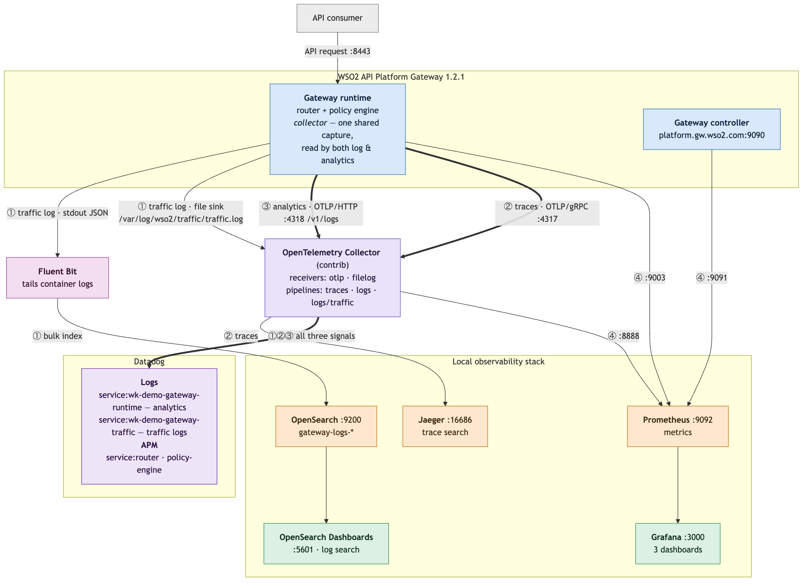

# WSO2 API Platform Demo — Observability and Analytics

Everything the gateway can tell you about the traffic it handles: **traffic logging**,
**distributed tracing**, **metrics**, and **analytics** — the last exported over OpenTelemetry to
**Datadog**.

This guide assumes the platform from [`setup.md`](setup.md) is already running and the demo from
[`README.md`](../API_Platform_Demo/README.md) works. It requires gateway **1.2.1**, which the
distribution in this repo is already pinned to — see [Step 1](#step-1--the-gateway-version).

**Verified.** Every step and every verification command below was run end to end against the
deployment in `verify-work/` — the core stack on 2026-09-21, and the later additions (traffic logs
to Datadog via the `filelog` receiver, the subscription-plan property, and the correlation findings)
on 2026-09-22. The numbers quoted in [Verification](#verification) are from those runs; the
collector's cumulative counters will differ from yours.

**Conventions**

- Configs live in [`verify-work/observability/`](../verify-work/observability) and are mounted into
  the gateway stack from there. That directory is the source of truth — edit it, not the copies
  inside the distribution.
- Commands run from the demo machine. Paths are written against the space-free symlink
  `~/wk-demo` → the repo root (see `setup.md`, Step 0 — a space in `CARBON_HOME` breaks Carbon).

**Official documentation**

| Topic | Page |
|---|---|
| Traffic logging | [observability/traffic-logging](https://wso2.com/api-platform/docs/api-gateway/1.2.0/observability/traffic-logging/) |
| Tracing | [observability/tracing/overview](https://wso2.com/api-platform/docs/api-gateway/1.2.0/observability/tracing/overview/) |
| Metrics | [observability/metrics/overview](https://wso2.com/api-platform/docs/api-gateway/1.2.0/observability/metrics/overview/) |
| Moesif analytics | [analytics/moesif-analytics](https://wso2.com/api-platform/docs/api-gateway/1.2.0/analytics/moesif-analytics/) |
| OpenTelemetry analytics | [analytics/opentelemetry-analytics](https://wso2.com/api-platform/docs/api-gateway/1.2.0/analytics/opentelemetry-analytics/) |

---

## Table of contents

1. [What you are building](#1-what-you-are-building)
2. [Step 1 — The gateway version](#step-1--the-gateway-version)
3. [Step 2 — Gateway configuration](#step-2--gateway-configuration)
4. [Step 3 — Compose wiring](#step-3--compose-wiring)
5. [Step 4 — Start the stack](#step-4--start-the-stack)
6. [Step 5 — Datadog](#step-5--datadog)
7. [Verification](#verification)
8. [Corrections to the shipped configuration](#corrections-to-the-shipped-configuration)
9. [Known gaps](#known-gaps)
10. [Viewing the logs](#viewing-the-logs)
11. [Correlating one request across components](#correlating-one-request-across-components)
12. [Troubleshooting](#troubleshooting)

---

## 1. What you are building



The Mermaid source is [`observability-slide.mmd`](observability-slide.mmd); an SVG is alongside it.

### The one idea that makes the rest make sense

Traffic logging and analytics are **not two features**. They are two *consumers* of one shared
capture pipeline called the **collector**. The collector has no on/off switch: it activates
automatically as soon as either consumer is enabled, and both read the same captured data.

That is why `[collector] request_headers = true` is what makes headers available, and
`traffic_logging.request_headers = true` only *selects among* what the collector already captured.
Turning the second on without the first is a silent no-op.

```
                                            ┌─► stdout ──► container log ──► Fluent Bit ──► OpenSearch
Envoy access log ──ALS──► collector ──┬─ traffic logging ─┤
   (fires for every request,          │                   └─► file ──► traffic.log ──► OTel filelog ──► Datadog
    including ones an auth policy     │
    rejected before any logic ran)    └─ analytics ──► otel publisher ──► OTLP/HTTP /v1/logs ─┐
                                                   └─ moesif publisher ──► api.moesif.net     │
                                                                                              │
gateway [tracing] ──────────── OTLP/gRPC spans ──────────────────────────────────────┐        │
                                                                                     ▼        ▼
                                                                          OpenTelemetry Collector
                                                                                     │        │
                                                              traces ──► Jaeger ◄────┘        │
                                                              traces + logs ──► Datadog ◄─────┘

gateway [controller.metrics] :9091 ──┐
gateway [policy_engine.metrics] :9003 ├──► Prometheus ──► Grafana
OpenTelemetry Collector :8888 ───────┘
```

### The four pillars

| Pillar | What it gives you | Where it lands |
|---|---|---|
| **Traffic logging** | One structured JSON line per request — API identity, consumer identity, status, four latency breakdowns, headers, custom CEL properties | policy-engine stdout, a rotating file, and OpenSearch via Fluent Bit |
| **Tracing** | Per-request spans across Envoy → policy engine → upstream, including the `dynamic-routing` decision in the span name | Jaeger (and Datadog APM) |
| **Metrics** | Prometheus series for the controller, the policy engine, the analytics publishers and the collector itself | Prometheus, Grafana |
| **Analytics** | One OTLP **log record** per API transaction, with OpenTelemetry semantic-convention attributes plus the `wso2.*` namespace (API product, consumer, cost, GenAI, MCP) | Datadog Logs via the OpenTelemetry Collector |

> **Why analytics uses the logs signal, not metrics or traces.** Metrics aggregate the transaction
> away, and traces impose a sampling model that would silently discard billing-relevant events. Only
> a log record carries a whole transaction with its attributes intact.

### Port map (additions to `setup.md`'s)

| Port | Component | What it is |
|---|---|---|
| 16686 | Jaeger | Trace UI |
| 4317 / 4318 | OpenTelemetry Collector | OTLP gRPC (traces) / OTLP HTTP (analytics log records) |
| 8889 | OpenTelemetry Collector | The collector's own Prometheus metrics (container port 8888) |
| 9092 | Prometheus | UI and query API (9090 inside the container; 9092 on the host avoids the gateway controller) |
| 3000 | Grafana | Dashboards (`admin` / `admin`) |
| 9200 | OpenSearch | Log store |
| 5601 | OpenSearch Dashboards | Log UI |
| 9091 | Gateway controller | Prometheus metrics |
| 9003 | Policy engine | Prometheus metrics — including `policy_engine_analytics_*` |

---

## Step 1 — The gateway version

Observability needs gateway **1.2.1 or later**: the OpenTelemetry analytics publisher requires
`1.2.0.11`+, and the `file`/`http` traffic-log sinks require `1.2.0.2`+. Neither is a config flag —
the code is absent from earlier binaries. The `1.2.0.x` update levels are WSO2 update-channel tags
that are not on public GHCR; `1.2.1` is the public tag that carries both.

**The gateway distribution in this repo is already pinned to 1.2.1** — `build.yaml` sets
`gateway.version: 1.2.1` and `docker-compose.yaml` names the `:1.2.1` images. Nothing to change.
Step 3 of [`setup.md`](setup.md) builds those images with the demo's custom `dynamic-routing`
policy compiled in:

```bash
cd ~/wk-demo/verify-work/setup/wso2apip-api-gateway-1.2.0
ap gateway image build --name wk-gateway
```

---

## Step 2 — Gateway configuration

The complete file is [`verify-work/observability/gateway/config.toml`](../verify-work/observability/gateway/config.toml).
Install it with:

```bash
cd ~/wk-demo/verify-work/observability
./apply.sh            # copies gateway/config.toml into the distribution, backing up the old one
./apply.sh --restart  # ... and restarts the stack
```

The four blocks that matter, and the reasoning behind each value:

### 2.1 Traffic logging

```toml
[router.access_logs]
enabled = true                    # Envoy's own text access log. Thin: no API or consumer identity.

[collector]
request_headers = true
response_headers = true
request_body = false              # every demo request carries a bearer token and an order payload
response_body = false
ignore_path_prefixes = ["/health", "/metrics"]

[traffic_logging]
enabled = true
outputs = ["stdout", "file"]      # additive; `file` needs >= 1.2.0.2
masked_headers = ["authorization", "x-api-key", "x-jwt-assertion", "subscription-key"]
max_payload_size = 4096
request_headers = true
response_headers = true

[traffic_logging.file]
path = "/var/log/wso2/traffic/traffic.log"
max_size_mb = 100                 # worst case on disk is 2x this (live + one rotation)

[traffic_logging.properties]
env = "wk-demo"
apiName = "$ctx:api.name"
orgName = "$ctx:request.header['x-org-name']"
useCaseId = "$ctx:request.header['x-use-case-id']"
subject = "$ctx:auth.subject != '' ? auth.subject : 'anonymous'"
subscriptionPlan   = "$ctx:'x-wso2-subscription-plan-name' in metadata ? metadata['x-wso2-subscription-plan-name'] : ''"
subscriptionStatus = "$ctx:'x-wso2-subscription-status' in metadata ? metadata['x-wso2-subscription-status'] : ''"
```

#### Putting the subscription plan on the log line

Two things are needed, and the first is the one that actually gates it.

**The API must carry the `subscription-validation` policy.** Without it nothing validates a
subscription, so there is no plan to report and the property renders empty. In
`OrderManagementAPI-v1.0.yaml`, after `jwt-auth`:

```yaml
    - name: subscription-validation
      version: v1
      params:
        subscriptionKeyHeader: Subscription-Key
```

**Then read it out of the `metadata` bag.** The keys are the **wire header names**, not the
friendly field names:

| Metadata key | Example |
|---|---|
| `x-wso2-subscription-plan-name` | `Silver` / `Gold` |
| `x-wso2-subscription-status` | `ACTIVE` |

> The policy-engine binary also contains the string `subscriptionPlanName`. **It is not the metadata
> key** — using it resolves to empty with no error. The real keys were found by adding a throwaway
> property `_allMetadata = "$ctx:metadata"`, which dumps the whole map onto the log line. That trick
> works for discovering anything a policy chain exposes.

The `in` guard is mandatory: indexing a missing map key raises "no such key" and the property is
then silently dropped from the line.

**Consequence worth planning for:** once the policy is attached, every call needs a valid
`Subscription-Key` header or it returns **403**. Verified: with the key → 200 and
`subscriptionPlan: "Silver"`; without → 403 and an empty plan. `subscription-validation` puts only
those two keys in metadata — no application identity, so `applicationName` stays empty unless an
auth policy that stamps it (such as `api-key-auth`) also runs.

`ignore_path_prefixes` is enforced **by Envoy**, via an access-log filter, so suppressed requests
never reach the policy engine at all — it is a real saving, not a filter applied after the fact.

The `properties` block is where a demo earns its keep: `X-Org-Name` is what `dynamic-routing` and
`advanced-ratelimit` key on, so putting it on the log line makes the multi-tenant story legible in
the log itself. The `auth.subject != '' ? ... : 'anonymous'` shape is the recommended pattern —
scalar `auth.*` variables resolve to their zero value on an unauthenticated request rather than
erroring, but indexing into a map (`auth.property['x']`) still needs an `in` guard.

### 2.2 Tracing

```toml
[tracing]
enabled = true
endpoint = "otel-collector:4317"
insecure = true
service_version = "1.2.1"
batch_timeout = "1s"
max_export_batch_size = 512
sampling_rate = 1.0               # every request; lower for real traffic (0.1 = 10%)
```

### 2.3 Metrics

```toml
[controller.metrics]
enabled = true
port = 9091

[policy_engine.metrics]
enabled = true
port = 9003
```

### 2.4 Analytics

```toml
[analytics]
enabled = true
enabled_publishers = ["otel"]     # add "moesif" when you have an application id

[analytics.publishers.otel]
endpoint = "http://otel-collector:4318/v1/logs"   # the /v1/logs path is required
allow_insecure_transport = true                   # required for plaintext http://
service_name = "wk-demo-gateway-runtime"
service_version = "1.2.1"
compression = "gzip"
batch_size = 100
flush_interval = "5s"
queue_capacity = 10000            # must be >= batch_size
on_queue_full = "drop_new"
timeout = "10s"
max_retries = 3
retry_backoff = "1s"
retry_abort_queue_ratio = 0.5

[analytics.publishers.otel.resource_attributes]
"deployment.environment.name" = "demo"
"service.namespace" = "wk-demo"
```

Publishers are **additive and independent** — `["moesif", "otel"]` delivers every event to both and
neither can fail the other. An unknown name is a startup error, not a silent no-op. Writing an
`[analytics.publishers.otel]` block *without* adding `"otel"` to `enabled_publishers` produces a
perfectly valid config that publishes nothing.

> **Moesif is configured but not enabled.** This demo has no Moesif account. The
> `[analytics.publishers.moesif]` block is present and complete; enabling it with the placeholder
> application id would make every event fail and show up as
> `policy_engine_analytics_dropped_total{publisher="moesif"}`. To turn it on: set
> `APIP_GW_ANALYTICS_PUBLISHERS_MOESIF_APPLICATION_ID` in `api-platform.env` and change
> `enabled_publishers` to `["otel", "moesif"]`.

> **Credentials never go in `config.toml` literally.** Use `{{ env "VAR" }}` or
> `{{ file "/path" }}`. On Kubernetes the Helm chart *enforces* this — `config.toml` renders into a
> ConfigMap, so it fails templating if any `analytics.publishers.otel.headers` entry holds a literal
> value. A literal prefix is fine: `Bearer {{ env "TOKEN" }}`.

---

## Step 3 — Compose wiring

The gateway's `docker-compose.yaml` already defines the observability services behind three
profiles: `tracing` (Jaeger, OpenTelemetry Collector), `logging` (OpenSearch, OpenSearch Dashboards,
Fluent Bit) and `metrics` (Prometheus, Grafana). Five changes are needed on top.

| Change | Why |
|---|---|
| `otel-collector` image → `otel/opentelemetry-collector-contrib` | The `datadog` exporter ships **only** in contrib. See [Step 5](#step-5--datadog). |
| Config mounts repointed to `../../observability/...` | Keeps every config in `verify-work/observability` instead of scattered inside the distribution. Compose resolves relative paths against the Compose file's directory. |
| `traffic-logs` named volume on `gateway-runtime` | Target for the `file` sink. |
| A `traffic-log-init` one-shot that chowns that volume | See below. |
| `8889:8888` published on the collector | So Prometheus can scrape the collector's own metrics. |
| `traffic-logs` mounted **read-only** on the collector | Lets the `filelog` receiver tail the traffic-log file sink. See below. |
| A healthcheck on `opensearch` + `condition: service_healthy` on `fluent-bit` | Stops Fluent Bit flushing before OpenSearch can accept writes. See below. |

### Shipping traffic logs to Datadog

The collector tails the file sink and feeds it into the same Datadog exporter the analytics records
already use — one egress, one credential, one place to debug. In `config-datadog.yaml`:

```yaml
receivers:
  filelog/traffic:
    include: [/var/log/wso2/traffic/traffic.log]
    start_at: end
    operators:
      - type: json_parser          # promote the JSON fields to searchable attributes
        parse_from: body

processors:
  resource/traffic:
    attributes:
      - key: service.name
        value: wk-demo-gateway-traffic   # separates them from the analytics stream
        action: upsert

service:
  pipelines:
    logs/traffic:
      receivers: [filelog/traffic]
      processors: [memory_limiter, batch, resource/traffic]
      exporters: [datadog, debug]
```

and the mount:

```yaml
  otel-collector:
    volumes:
      - traffic-logs:/var/log/wso2/traffic:ro
```

Three things that matter:

- **Permissions work out.** `traffic.log` is mode 0600 owned by uid 10001, and the collector image
  also runs as 10001, so nothing has to be loosened.
- **`start_at: end`, not `beginning`.** The receiver keeps its file offset only in memory, so
  `beginning` re-ships the *entire* file to Datadog on every collector restart — 158 duplicate lines
  the first time this was tried. `end` costs only the lines written while the collector was down.
- **No timestamp parser is configured.** Datadog orders these by ingest time; the original is kept
  as the `@timestamp` attribute. A wrong `layout` string is a collector startup failure, so add one
  deliberately and test it if event-time ordering matters.

### Fluent Bit must wait for OpenSearch

`depends_on: [opensearch]` waits for the container to *start*, not to be ready, so Fluent Bit's
first chunks fail and retry for ~15 s after every `compose up`. Harmless and self-healing, but it
looks like breakage. Fixed with a readiness gate:

```yaml
  opensearch:
    healthcheck:
      test: ["CMD-SHELL", "curl -sf http://localhost:9200/_cluster/health || exit 1"]
      interval: 10s
      timeout: 5s
      retries: 12
      start_period: 30s

  fluent-bit:
    depends_on:
      opensearch:
        condition: service_healthy
```

### The file sink needs a writable volume

The sink opens its file as uid **10001** (the `wso2` user the runtime image runs as), but a fresh
Docker named volume is created **root-owned**. Docker only inherits ownership from the image when
the mountpoint already exists in it, and `/var/log/wso2` does not. The result is a startup failure,
by design — the sink fails closed rather than silently falling back to stdout:

```
Failed to load configuration from /etc/policy-engine/config.toml: invalid configuration:
  traffic_logging.file: cannot open "/var/log/wso2/traffic/traffic.log" for append:
  open /var/log/wso2/traffic/traffic.log: permission denied
```

A one-shot init service fixes it before the runtime starts:

```yaml
  traffic-log-init:
    image: alpine:3.21
    command: ["sh", "-c", "chown 10001:10001 /var/log/wso2/traffic && chmod 700 /var/log/wso2/traffic"]
    volumes:
      - traffic-logs:/var/log/wso2/traffic
    profiles: ["logging"]

  gateway-runtime:
    # ...
    depends_on:
      traffic-log-init:
        condition: service_completed_successfully
```

> Use a **named volume, not a host bind**. The sink refuses to start if the file already exists and
> is group- or world-readable, which is exactly what a host bind on macOS gives you. It also must be
> a **per-pod / per-replica** volume — a shared RWX volume written by more than one gateway silently
> loses records.

---

## Step 4 — Start the stack

Enable the profiles in the gateway stack's `.env`:

```bash
# ~/wk-demo/verify-work/setup/wso2apip-api-gateway-1.2.0/.env
COMPOSE_PROFILES=tracing,logging,metrics
OTEL_COLLECTOR_CONFIG=config.yaml        # or config-datadog.yaml — see Step 5
```

```bash
cd ~/wk-demo/verify-work/setup/wso2apip-api-gateway-1.2.0
docker compose up -d
docker compose ps
```

Eleven services: the two gateway containers plus Jaeger, the collector, OpenSearch, OpenSearch
Dashboards, Fluent Bit, Prometheus, Grafana, and the init one-shot.

A healthy gateway-runtime logs all three consumers starting:

```
msg="OTel analytics publisher started" endpoint=http://otel-collector:4318/v1/logs batchSize=100 ...
msg="Traffic logging file sink ready" path=/var/log/wso2/traffic/traffic.log maxSizeMB=100 existingBytes=0
msg="Traffic logging publisher added" outputs="[stdout file]"
[rtr] instantiating a new tracer: envoy.tracers.opentelemetry
```

---

## Step 5 — Datadog

Analytics reaches Datadog through the OpenTelemetry Collector's `datadog` exporter, on **both**
signals: traces to Datadog APM, and the analytics log records to Datadog Logs.

### The image

The `datadog` exporter exists **only in the contrib distribution**. On the core image the config is
rejected outright:

```
error decoding 'exporters': unknown type: "datadog" for id: "datadog"
  (valid values: [nop otlp kafka opencensus prometheus prometheusremotewrite debug otlphttp file zipkin])
```

The gateway's shipped `docker-compose.yaml` names the **core** image, so this must be changed.

### The credentials

```bash
# verify-work/observability/datadog/datadog.env
DD_API_KEY=<your Datadog API key>     # Organization Settings -> API Keys
DD_SITE=datadoghq.com                 # or datadoghq.eu, us3/us5.datadoghq.com, ap1.datadoghq.com, ddog-gov.com
```

The file is mounted as an `env_file` on the collector. With
`fail_on_invalid_key: true` the collector refuses to start on a bad key rather than dropping every
export silently.

### Switch the pipeline on

```bash
cd ~/wk-demo/verify-work/setup/wso2apip-api-gateway-1.2.0
sed -i '' 's/^OTEL_COLLECTOR_CONFIG=.*/OTEL_COLLECTOR_CONFIG=config-datadog.yaml/' .env
docker compose up -d otel-collector
```

[`config-datadog.yaml`](../verify-work/observability/otel-collector/config-datadog.yaml) adds:

```yaml
exporters:
  datadog:
    api:
      key: ${env:DD_API_KEY}
      site: ${env:DD_SITE}
      fail_on_invalid_key: true
    hostname: wk-demo-gateway     # containers have no useful host identity

service:
  pipelines:
    traces:
      exporters: [otlp/jaeger, datadog, debug]
    logs:
      exporters: [datadog, debug]
```

> **A collector with no `logs` pipeline accepts the connection and silently discards every analytics
> record.** It is by far the most common cause of "exports succeed but nothing appears downstream",
> and the collector config the gateway distribution ships has **traces only**. That missing pipeline
> is the single most important edit in this whole guide.

### What to look for in Datadog

**Two log streams**, separated by service:

| Stream | Query | Source |
|---|---|---|
| Analytics events | `service:wk-demo-gateway-runtime` | the `otel` publisher, OTLP |
| Traffic logs | `service:wk-demo-gateway-traffic` | the `filelog` receiver tailing the file sink |

```
service:wk-demo-gateway-runtime @event.name:wso2.api.transaction
service:wk-demo-gateway-traffic @api.name:OrderManagementAPI
service:wk-demo-gateway-traffic @properties.subscriptionPlan:Gold
service:wk-demo-gateway-traffic @latencies.backendLatencyUs:>5000
```

Attributes are searchable immediately but are not clickable facets until you create them (expand a
log → hover the attribute → **Create facet**). Worth having before a demo: `@wso2.api.name`,
`@http.response.status_code`, `@api.name`, `@properties.subscriptionPlan`.

**APM** → service `router` and `policy-engine`. Note that trace *metrics* are disabled by default in
this exporter version (the collector says so at startup); individual traces appear normally, but
per-service latency percentiles need the Datadog Connector. Use Grafana for those here.

---

## Verification

For **UI verification** — click-through checks in Jaeger, Grafana, Prometheus, OpenSearch
Dashboards and Datadog, with what a healthy screen looks like in each — see
[`verify.md`](verify.md).

### The short way

```bash
cd ~/wk-demo/verify-work/observability
./verify.sh              # check everything
./verify.sh --traffic    # send a few API calls first, then check
```

33 checks across the platform, the gateway build, and all four pillars. Exit status is 0 only when
every required check passes; Datadog is reported as optional until you supply a key.

```
1. Platform (setup.md)          API Manager / IS / portal / gateway / mediator / mocks, catalog counts
2. Gateway build                image is 1.2.1, dynamic-routing policy loaded
3. Traffic logging              file sink lines + mode 0600, stdout sink, OpenSearch docs, Fluent Bit health
4. Tracing                      Jaeger services and traces, spans accepted by the collector
5. Metrics                      3/3 Prometheus targets, metric-name count, Grafana dashboards
6. Analytics                    records published, dropped == 0, accepted/refused at the collector

33 passed, 0 failed
Everything is set up.
```

### The long way

Run top to bottom. The numbers in the right-hand column are from the verified run.

### 1. Traffic logging — the file sink

Resolve the container name once — Compose prefixes it with the project name, so it is not simply
`gateway-runtime`:

```bash
GW=~/wk-demo/verify-work/setup/wso2apip-api-gateway-1.2.0
RT=$(cd $GW && docker compose ps -q gateway-runtime)
```

Then check the file's mode and read the last line. Keep these as **two commands**: `ls` prints
`total 16`, which is not JSON, so piping both into `jq` fails with
`parse error: Invalid literal at line 1, column 6`.

```bash
docker exec "$RT" ls -l /var/log/wso2/traffic/
docker exec "$RT" tail -1 /var/log/wso2/traffic/traffic.log | jq .
```

The file is `-rw------- wso2 wso2`, and each line carries `api`, `operation`, `target`, `client`,
`latencies` (four separate measurements) and your `properties`:

```json
{
  "component": "pol",
  "correlationId": "7cea2b57-a20d-9797-bdcd-d3f3717ede33",
  "status": 200,
  "api":       { "name": "AgentChatAPI", "version": "v1.0", "context": "/agent/v1.0", "kind": "RestApi" },
  "operation": { "method": "POST", "path": "/agent/v1.0/chat/completions" },
  "target":    { "statusCode": 200, "destination": "host.docker.internal/chat/completions" },
  "latencies": { "durationUs": 18574, "requestMediationLatencyUs": 1808,
                 "responseMediationLatencyUs": 3839, "backendLatencyUs": 12681 },
  "properties":{ "apiName": "AgentChatAPI", "env": "wk-demo", "subject": "JxamVajHQK7bv6ndqYgcEFTWx1Aa" }
}
```

A denied request produces a line too — that is the thing Envoy's access log cannot give you with
API identity attached.

### 2. Traffic logging — OpenSearch

```bash
curl -s "http://localhost:9200/_cat/indices/gateway-logs-*?v"
curl -s "http://localhost:9200/gateway-logs-*/_search?size=1" -H 'Content-Type: application/json' -d '{
  "query": {"bool": {"must": [
    {"term": {"component.keyword": "<project>-gateway-runtime-1"}},
    {"exists": {"field": "api.name"}}]}},
  "sort": [{"@timestamp": "desc"}]}' | jq '.hits.hits[0]._source'
```

The structured line survives the trip intact — `api`, `status`, `operation`, `properties`,
`latencies` are all queryable fields. OpenSearch Dashboards is on <http://localhost:5601>.

### 3. Tracing

```bash
curl -s http://localhost:16686/api/services | jq -r '.data[]'
# router
# policy-engine

curl -s "http://localhost:16686/api/traces?service=router&limit=1" \
  | jq -r '.data[0].spans[] | "\(.operationName)  \(.duration)us"'
# ingress                                                              6684us
# async envoy.service.ext_proc.v3.ExternalProcessor.Process egress     6656us
# router upstream_RestApi_01a0c3a5-..._railco egress                   2288us
```

Note the third span: the upstream span name carries the **`dynamic-routing` decision** (`_railco`),
so the demo's per-tenant routing is visible in the trace itself. Jaeger UI:
<http://localhost:16686>.

### 4. Metrics

```bash
curl -s http://localhost:9092/api/v1/targets | jq -r '.data.activeTargets[] | "\(.labels.job)\t\(.health)"'
# gateway-controller  up
# otel-collector      up
# policy-engine       up
```

152 distinct metric names were scraped in the verified run. Grafana on <http://localhost:3000>
(`admin`/`admin`) provisions three dashboards — *Gateway Controller*, *Policy Engine*,
*Infrastructure Overview* — against the Prometheus datasource.

### 5. Analytics — the publisher

Every series is labelled `publisher`, so Moesif and OTel are separable:

```bash
curl -s http://localhost:9092/api/v1/query --data-urlencode \
  'query=policy_engine_analytics_published_total' | jq -r '.data.result[] | "\(.metric.publisher)=\(.value[1])"'
# otel=30

curl -s http://localhost:9092/api/v1/query --data-urlencode \
  'query=sum(policy_engine_analytics_dropped_total)' | jq -r '.data.result[0].value[1]'
# 0
```

Counters are **materialised at zero** at startup, so a healthy gateway reports `dropped_total 0`
rather than an absent series — "nothing was dropped" stays distinguishable from "the metrics path is
broken". Useful alerts:

```promql
# losing records at all?
sum by (publisher, reason) (rate(policy_engine_analytics_dropped_total[5m])) > 0

# queue pressure as a fraction of capacity (alert above ~0.5)
sum by (publisher) (policy_engine_analytics_queue_depth)
  / sum by (publisher) (policy_engine_analytics_queue_capacity)
```

Always `sum by (publisher)`, never a bare `sum()` — with two publishers enabled one request produces
one delivery *per publisher*, so a bare sum reads as double the request rate.

### 6. Analytics — the collector

```bash
curl -s http://localhost:8889/metrics | grep -E "^otelcol_receiver_(accepted|refused)_(log_records|spans)"
# otelcol_receiver_accepted_log_records{...transport="http"}  18
# otelcol_receiver_refused_log_records{...transport="http"}    0
# otelcol_receiver_accepted_spans{...transport="grpc"}        268
# otelcol_receiver_refused_spans{...transport="grpc"}           0
```

> The gateway's `published_total` (30) exceeds the collector's `accepted_log_records` (18) only
> because the collector was restarted mid-run and its counters reset. `dropped_total = 0` on the
> gateway side is the authoritative "nothing was lost" signal.

One record, as the collector sees it — scope `wso2.analytics`, `event.name`
`wso2.api.transaction`:

```
InstrumentationScope wso2.analytics
Body: Str(POST /orders)
     -> event.name: Str(wso2.api.transaction)
     -> http.request.method: Str(POST)          -> http.response.status_code: Int(200)
     -> wso2.api.name: Str(OrderManagementAPI)  -> wso2.api.version: Str(v1.0)
     -> wso2.api.context: Str(/order-management/v1.0)
     -> user.id: Str(JxamVajHQK7bv6ndqYgcEFTWx1Aa)
     -> wso2.latency.backend_ms: Int(49)        -> wso2.latency.duration_ms: Int(407)
     -> wso2.upstream.destination: Str(host.docker.internal/orders)
     -> http.response.header.content-type: Slice(["application/json"])
```

For AI traffic the publisher also maps the GenAI semantic conventions
(`gen_ai.request.model`, `gen_ai.usage.input_tokens`, `wso2.gen_ai.cost.total`), and for MCP traffic
the MCP conventions (`mcp.method.name`, `mcp.session.id`, `gen_ai.tool.name`).

### 7. Datadog exporter

Without a key you can still prove the exporter is wired:

```bash
cd ~/wk-demo/verify-work/observability
docker run --rm -e DD_API_KEY=dummy -e DD_SITE=datadoghq.com \
  -v "$PWD/otel-collector:/etc/otel-collector:ro" \
  otel/opentelemetry-collector-contrib:0.112.0 --config=/etc/otel-collector/config-datadog.yaml
```

Expect the exporter to initialise on both signals and then reject the key — which is the proof that
the config is valid and only the credential is missing:

```
info  provider/provider.go:71  Resolved source  {"data_type": "logs", "name": "datadog",
                                                 "source": {"Kind":"host","Identifier":"wk-demo-gateway"}}
info  Trace writer initialized (climit=5 qsize=1 compression=gzip)  {"data_type": "traces", "name": "datadog"}
warn  Error while validating API key
```

---

## Corrections to the shipped configuration

Four things in the distribution's own observability assets do not work as shipped on this
deployment. All four are fixed in `verify-work/observability/`.

### 1. Fluent Bit ships a log feedback loop

`observability/fluent-bit/fluent-bit.conf` sets `trace_output On` and `trace_error On`. Fluent Bit
then prints every `_bulk` request **and response** to its own stdout — which is a container log
under `/var/lib/docker/containers`, which the `tail` input is reading. Every shipped record produces
new lines to ship.

On this machine that reached **6,627,997 documents and 459 MB in about five minutes**, and took the
host from 19 GB to 9.4 GB free. It is self-amplifying, not merely verbose.

Fixed by removing both `trace_*` flags, adding a `grep` filter that drops records whose resolved
`component` is `fluent-bit`, and setting `Read_from_Head Off` so a restart does not re-ship every
historical line on the host. Also raised the output `Buffer_Size` from 2 MB, which was causing
`cannot increase buffer: current=2000000 requested=2032768` followed by endless flush retries of
otherwise healthy batches. After the fix: **1,936 documents / 370 KB** for the same workload.

### 2. Prometheus scrapes service names that do not exist

`observability/prometheus/prometheus.yml` targets `policy-engine:9003` and `router:9901`. Neither is
a Compose service — the file defines only `gateway-controller` and `gateway-runtime`, and the
runtime container hosts *both* Envoy and the policy engine. Fixed to `gateway-runtime:9003`.

### 3. Envoy's admin interface is not enabled, so there is no `router` metrics target

The docs and the shipped scrape config both point at `9901/stats/prometheus`, and
`docker-compose.yaml` publishes 9901 — but nothing listens there. Inside the runtime container:

```bash
docker exec "$RT" netstat -tlnp
# 0.0.0.0:8080   envoy
# 0.0.0.0:8443   envoy
# :::9002        policy-engine
# :::9003        policy-engine
```

`config-template.toml` exposes no switch to turn the admin listener on. The `router` job is
therefore **omitted** rather than left permanently DOWN. Envoy's request-level data still reaches
you through traffic logging and the tracing and analytics pipelines.

### 4. The collector config has no `logs` pipeline

Traces only. Analytics records would be accepted and silently discarded. Added.

### 5. The gateway containers are CPU-starved to the point of breaking the management API

The shipped `docker-compose.yaml` caps the controller at **`cpus: 0.025`** (2.5% of one core) and
`mem_limit: 60m`, and the runtime at `cpus: 0.175` / `mem_limit: 180m`.

The controller's management API authenticates with **bcrypt**, which is deliberately CPU-hard. At
0.025 CPU a plain `GET /rest-apis` takes **~4.5 seconds**:

```
call 1: HTTP 200  total=5.088273s
call 2: HTTP 200  total=4.569835s
call 3: HTTP 200  total=4.285447s
```

That is slow enough to break anything that drives the endpoint. Two symptoms traced back to it:

- `verify.sh` intermittently reporting **0 REST APIs / 0 MCP proxies / 0 subscriptions** while the
  gateway was demonstrably serving traffic — the calls were failing or timing out, and `jq` turned
  the error body into a silent zero.
- the subscription-mediator logging
  `context deadline exceeded (Client.Timeout exceeded while awaiting headers)` against
  `POST /subscriptions`, then abandoning the event.

The runtime was also already at **86 MiB of its 180 MiB cap at idle**, while carrying all API
traffic plus the policy engine, both traffic-log sinks and the analytics publisher.

Raised to `cpus: 1.0` / `mem_limit: 512m` (controller) and `cpus: 2.0` / `mem_limit: 1g` (runtime).
The same call now takes **0.05 s** — roughly 90x faster. The shipped values look like a
minimal-footprint default; they are not workable for anything that uses the management API.

`verify.sh` now checks this directly:

```
PASS  Management API latency    0.055373s
```

and a management-API check that fails reports the HTTP status or timeout instead of `got 0`.

---

## Known gaps

### Request headers are not captured on successful requests

With `collector.request_headers = true` and `traffic_logging.request_headers = true`, request
headers appear **only on requests the gateway short-circuits** (an auth denial). Successfully
proxied requests carry `responseHeaders` but never `requestHeaders`:

```bash
docker exec "$RT" cat /var/log/wso2/traffic/traffic.log \
  | jq -c '{status, hasReq: (.requestHeaders != null), hasResp: (.responseHeaders != null)}'
# {"status":200,"hasReq":false,"hasResp":true}
# {"status":200,"hasReq":false,"hasResp":true}
# {"status":200,"hasReq":false,"hasResp":true}
# {"status":401,"hasReq":true, "hasResp":false}
```

The same asymmetry shows in the analytics records: `http.response.header.*` attributes are present,
`http.request.header.*` are not. Because both consumers read the one shared collector, this is in
the capture pipeline, not in either consumer.

The practical consequence for this demo: any `traffic_logging.properties` expression reading
`request.header['...']` resolves empty on successful traffic — `orgName` and `useCaseId` populate
only on denied requests. If you need the calling org on every line, derive it from an auth claim
(`auth.property[...]`) or from `metadata[...]` written by a policy, rather than from the header.

Reported as observed on gateway 1.2.1; worth raising with the gateway team.

### Router and policy-engine traces are not linked

Covered in [Correlating one request across components](#correlating-one-request-across-components).
Stamping the correlation ID onto the policy engine's root span would make this a one-tag lookup;
the value is already in the request headers the policy engine receives.

### Not covered here

- **Moesif** is configured but not enabled — no account. One line in `enabled_publishers` turns it
  on once you have an application id.
- **Metrics to Datadog** would be a fourth path (Datadog Agent scraping the Prometheus endpoints, or
  a `prometheus` receiver in the collector). Only traces and analytics logs go to Datadog here.
- **`http` traffic-log sink** — the third sink alongside `stdout` and `file`, for posting batches
  straight to a log receiver. Available on 1.2.1; not configured here.

---

## Viewing the logs

There are **seven distinct log streams** in this deployment, and the two most useful ones share a
single container's stdout. `logs.sh` separates them:

```bash
cd ~/wk-demo/verify-work/observability
./logs.sh                      # list the streams
./logs.sh traffic              # last 30 entries
./logs.sh traffic -f           # follow
./logs.sh traffic 100          # last 100
```

| Stream | What it is | Where it comes from |
|---|---|---|
| `access` | Envoy access log — one text line per request. Thin: method, path, status, bytes, durations, upstream. **No API or consumer identity.** | `gateway-runtime` stdout, `[rtr]` prefix |
| `traffic` | Traffic logging — one JSON line per request, with API identity, consumer, four latency breakdowns, headers and your CEL properties | the `file` sink, `/var/log/wso2/traffic/traffic.log` |
| `traffic-out` | The same lines on stdout | `gateway-runtime` stdout, `[pol]` prefix |
| `analytics` | OTLP analytics records as the collector received them | `otel-collector` |
| `traces` | Span summaries per trace | Jaeger API |
| `runtime` / `controller` / `portal` / `mediator` / `collector` / `fluentbit` | Raw component logs | each container |
| `apim` / `is` | Carbon logs of the two host Java processes | `repository/logs/wso2carbon.log` |
| `opensearch` | Every container's logs, aggregated and searchable | OpenSearch index `gateway-logs-*` |

### The two request logs, side by side

The same request, first as Envoy sees it and then as traffic logging does. This is the clearest way
to show why both exist:

```bash
./logs.sh access 1
[rtr] [2026-09-21T11:52:42.068Z] "POST /orders HTTP/2" /orders HTTP/1.1 200 - via_upstream - 23 121 56 2 2 0 53
      "-" "curl/8.7.1" "d1281905-a429-920c-882c-8411313f6c01" "host.docker.internal" "<MACHINE_IP>:7093"

./logs.sh traffic 1 | jq -c '{api:.api.name, status, latency_us:.latencies.durationUs, props:.properties}'
{"api":"OrderManagementAPI","status":401,"latency_us":null,
 "props":{"apiName":"OrderManagementAPI","env":"wk-demo","orgName":"railco","subject":"anonymous"}}
```

Envoy's line knows a POST returned 200 from an upstream. Traffic logging knows *which API*, *which
consumer*, and — on the denied request — that the caller claimed org `railco` and authenticated as
nobody.

### The UIs

| UI | URL | Credentials |
|---|---|---|
| Jaeger — traces | <http://localhost:16686> | none |
| Grafana — metrics dashboards | <http://localhost:3000> | `admin` / `admin` |
| Prometheus — raw queries and targets | <http://localhost:9092> | none |
| OpenSearch Dashboards — log search | <http://localhost:5601> | none |
| Datadog — APM + Logs | your Datadog org | filter `service:wk-demo-gateway-runtime` |

In OpenSearch Dashboards, create an index pattern for `gateway-logs-*` with `@timestamp` as the
time field. The traffic-log fields arrive already structured, so `api.name`, `status`,
`operation.path`, `properties.orgName` and `latencies.backendLatencyUs` are all directly filterable.

### Seeing every attribute of an analytics record

At `verbosity: normal` the collector prints one summary line per batch. To see full records, set
`verbosity: detailed` in `otel-collector/config*.yaml` and restart the collector — then
`./logs.sh analytics`. Switch it back afterwards: `detailed` produced ~1,900 OpenSearch documents
for five API calls, because the dump goes to the collector's stdout and Fluent Bit ships it.

---

## Correlating one request across components

**Router and policy-engine do not share a trace by default.** Each starts its own root trace, and
the policy-engine spans carry no request identifier at all — only `api_name`, `route_name`,
`policy_chain_key`, `terminal.reason`. The policy engine takes its trace context from the request
headers Envoy forwards over ext_proc, and Envoy does not inject one, so with no client-supplied
context it starts fresh.

**Send your own `traceparent` and they unify.** Verified: one trace, 20 spans, both services.

```bash
TID=$(openssl rand -hex 16); SID=$(openssl rand -hex 8)
curl -sk -X POST https://platform.gw.wso2.com:8443/order-management/v1.0/orders \
  -H "Authorization: Bearer $TOK" -H 'X-Org-Name: railco' \
  -H "Subscription-Key: $SUBKEY" -H "traceparent: 00-$TID-$SID-01" \
  -H 'Content-Type: application/json' -d '{"item":"demo"}'
echo "http://localhost:16686/trace/$TID"
```

You know the trace URL before you send the request — the right approach for a demo.

**For a request already made**, the join key is the correlation ID, which is the same value in
three places:

| Signal | Field |
|---|---|
| Traffic log | `correlationId` |
| Analytics record | `wso2.correlation.id` |
| Jaeger router span | tag `guid:x-request-id` |

```bash
curl -s --get http://localhost:16686/api/traces \
  --data-urlencode "service=router" \
  --data-urlencode "tags={\"guid:x-request-id\":\"$CID\"}" | jq -r '.data[].traceID'
```

In the Jaeger UI: **Service `router`**, Tags `guid:x-request-id=<id>`. This finds the **router**
trace only. Without a `traceparent`, the policy-engine half is a separate trace with no shared key —
the best you can do is match on the router trace's time window plus `operation_path`, which is exact
with one request in flight and ambiguous under concurrent load.

---

## Troubleshooting

| Symptom | Cause and fix |
|---|---|
| `unknown type: "datadog" for id: "datadog"` | The collector is the **core** image. Use `otel/opentelemetry-collector-contrib`. |
| Collector will not start, `Error while validating API key` | `DD_API_KEY` is empty or wrong in `observability/datadog/datadog.env`. `fail_on_invalid_key: true` makes this fatal on purpose. |
| Exports succeed, nothing in Datadog/downstream | The collector has no **`logs`** pipeline. Check `service.pipelines.logs` exists and names the exporter. |
| `traffic_logging.file: ... permission denied` at startup | The named volume is root-owned; the runtime is uid 10001. Add the `traffic-log-init` one-shot (Step 3). |
| Startup fails: `endpoint uses plaintext http:// but allow_insecure_transport is false` | Set `allow_insecure_transport = true` for a collector on the Compose network, or use `https://`. |
| Startup fails: `queue_capacity ... must be >= batch_size` | A queue smaller than a batch could never fill one. Raise `queue_capacity`. |
| Startup fails on an unknown publisher name | A typo in `enabled_publishers`. Unknown names fail closed. |
| OpenSearch index exploding, Fluent Bit retry storms | The `trace_output` feedback loop. See [Corrections](#1-fluent-bit-ships-a-log-feedback-loop). |
| Huge log volume from the collector itself | `debug` exporter at `verbosity: detailed` dumps every span and record to stdout, which Fluent Bit ships. Use `normal` except when troubleshooting. |
| A Prometheus target is permanently DOWN | `policy-engine`/`router` in the shipped scrape config are not Compose service names. See [Corrections](#2-prometheus-scrapes-service-names-that-do-not-exist). |
| `traffic_logging.request_headers = true` but no headers on the line | Either `collector.request_headers` is false (the toggle only *selects among* what the collector captured), or the request succeeded — see [Known gaps](#request-headers-are-not-captured-on-successful-requests). |
| A traffic-log property is always empty | Either the policy that populates it never ran (e.g. `subscriptionPlan` without `subscription-validation` on the API), or the metadata key is wrong. Add `_probe = "$ctx:metadata"` temporarily to see the whole map. |
| Every API call returns `403` | The API carries `subscription-validation`; send a valid `Subscription-Key`. |
| Datadog has analytics but no traffic logs | The `filelog` receiver or its `logs/traffic` pipeline is missing, or the `traffic-logs` volume is not mounted on the collector. |
| Fluent Bit logs a burst of `failed to flush` right after `compose up` | OpenSearch was not ready yet. Expected and self-healing; the healthcheck gate in Step 3 removes it. |
| Traces enabled but nothing in Jaeger | The collector is not running (`--profile tracing`), or `[tracing] endpoint` does not resolve from the runtime container. With tracing on and no collector, the gateway logs export warnings. |
