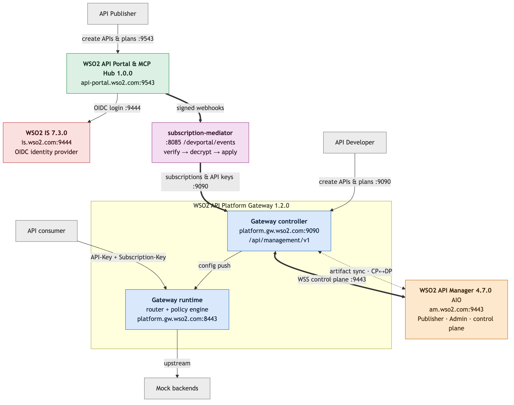

# WSO2 API Platform Demo — End-to-End Setup Guide

Build the whole demo from a bare machine: download the distributions, configure every
component, wire them together, and arrive at the point where
[`README.md`](README.md).

**Conventions**

- `<ANGLE_BRACKETS>` = a value you must supply. Section [Placeholder reference](#placeholder-reference)
  lists every one of them and exactly where it comes from.
- Commands are Bash, run on the demo machine itself.
- Every TLS endpoint here is **self-signed**, so `curl` always gets `-k` and Postman needs
  SSL verification turned off.

**Verified.** Steps 1–9 of this guide were run start to finish on a clean macOS machine on
2026-09-18, from the distribution zips, and each verification command in them passed. Step 10
(tenant onboarding) fails on a *freshly installed* IS 7.3.0 for the reason documented in that
step; it works against an IS whose organizations predate per-organization signing keys. The
findings from that run are folded into the steps below. One difference worth knowing: that
run used the stock `ghcr.io/wso2/api-platform/api-portal:1.0.0` image, not the custom
`ghcr.io/lasanthas/api-portal:1.0.0` this demo normally runs — the portal started and served
the OIDC redirect on both, but nothing past Step 9 has been verified on the stock image.

**Official documentation.** Each step links the WSO2 page that covers it. The three product
doc sets are:

| Product | Documentation |
|---|---|
| WSO2 API Manager 4.7.0 | [apim.docs.wso2.com](https://apim.docs.wso2.com/en/latest/) — in particular [Platform Gateway: Getting Started](https://apim.docs.wso2.com/en/latest/api-gateway/platform-gateway/getting-started/) |
| WSO2 API Platform Gateway 1.2.0 / API Portal 1.0.0 | [wso2.com/api-platform/docs](https://wso2.com/api-platform/docs/) |
| WSO2 Identity Server 7.3.0 | [is.docs.wso2.com](https://is.docs.wso2.com/en/latest/) |

---

## Table of contents

1. [What you are building](#1-what-you-are-building)
2. [The machine, prerequisites, and downloads](#2-the-machine-prerequisites-and-downloads)
3. [Hostnames and name resolution](#3-hostnames-and-name-resolution)
4. [Step 1 — WSO2 API Manager](#step-1--wso2-api-manager-the-control-plane)
5. [Step 2 — Register the gateway in API Manager](#step-2--register-the-gateway-in-api-manager)
6. [Step 3 — Build the gateway image with the custom policy](#step-3--build-the-gateway-image-with-the-custom-policy)
7. [Step 4 — DCR app, gateway config, first start](#step-4--dcr-app-gateway-config-first-start)
8. [Step 5 — Mock backends and the API/MCP catalog](#step-5--mock-backends-and-the-apimcp-catalog)
9. [Step 6 — subscription-mediator](#step-6--subscription-mediator)
10. [Step 7 — WSO2 Identity Server](#step-7--wso2-identity-server)
11. [Step 8 — Configure IS as the portal's IdP](#step-8--configure-is-as-the-portals-idp)
12. [Step 9 — API Portal](#step-9--api-portal)
13. [Step 10 — Onboard the `public` tenant](#step-10--onboard-the-public-tenant)
14. [Step 11 — Run the demo](#step-11--run-the-demo)
15. [Placeholder reference](#placeholder-reference)
16. [Full verification checklist](#full-verification-checklist)
17. [Troubleshooting](#troubleshooting)
18. [Config completeness audit — what `setup/resources` does and does not cover](#config-completeness-audit)
19. [Starting over](#starting-over)

---

## 1. What you are building

Six moving parts. Five are servers, one is a piece of glue written for this demo.

### WSO2 API Manager 4.7.0 — the control plane

[Product docs](https://apim.docs.wso2.com/en/latest/) · [Platform Gateway section](https://apim.docs.wso2.com/en/latest/api-gateway/platform-gateway/getting-started/)

Here it is used **only** as a control plane: the Publisher portal
(where APIs are designed and published), the Admin portal (where gateways and policies are
registered), and the internal key/lifecycle machinery.

API Manager's role is: register the gateway, hand it a **registration token**, show the APIs
the gateway reports, and push down APIs created in the Publisher.

### WSO2 API Platform Gateway 1.2.0 — the data plane

[Gateway overview](https://wso2.com/api-platform/docs/api-gateway/1.2.0/overview/) · [Management API](https://wso2.com/api-platform/docs/api-gateway/1.2.0/gateway-controller-management-api/overview/) · [Policies](https://wso2.com/api-platform/docs/api-gateway/1.2.0/policies/overview/)

An Envoy-based gateway with a Go policy engine, shipped as a **Docker Compose stack**. Two containers:

- **gateway-controller** — the gateway control plane. Holds a SQLite database of deployed APIs, subscriptions,
  plans and API keys; exposes a **management REST API on port 9090** (HTTP basic auth); holds
  an outbound **WebSocket to API Manager on 9443** which is the control-plane link.
- **gateway-runtime** — Envoy router plus the compiled-in policy engine. Terminates API
  traffic on **8443 (HTTPS)** and applies policies (`jwt-auth`, `advanced-ratelimit`, the
  custom `dynamic-routing`, …).

Artifacts move in both directions over that link:

- **DP→CP** — an API you create directly on the gateway (`POST /rest-apis`) is pushed *up* and
  appears in the Publisher. This uses API Manager's Publisher REST API with an OAuth2 client
  you create in Step 4 (the "DCR app").
- **CP→DP** — an API created in the Publisher and deployed to this gateway comes *down* over
  the WebSocket.

### WSO2 Identity Server 7.3.0 — the identity provider

[Product docs](https://is.docs.wso2.com/en/latest/) · [Organizations](https://is.docs.wso2.com/en/latest/guides/organization-management/manage-organizations/)

Run with **port offset 1** so it listens on **9444** and leaves 9443 free for API
Manager. Two jobs:

1. **Browser login for the API Portal** (OIDC authorization-code flow).
2. **Multi-tenancy.** Each demo tenant (`public`, `acme`, `railco`) is an IS *organization*
   with its own users, roles and OAuth2 client. Tokens minted by those clients are what the
   gateway's `jwt-auth` policy verifies against IS's JWKS endpoint.

IS is **not** a key manager for API Manager here. It never issues API keys or subscription
keys — those come from the portal.

### WSO2 API Portal & MCP Hub 1.0.0 — the developer portal

[Portal overview](https://wso2.com/api-platform/docs/api-portal/1.0.0/overview/) · [Secured API end to end](https://wso2.com/api-platform/docs/api-portal/1.0.0/tutorials/secured-api-end-to-end/) · [Webhooks](https://wso2.com/api-platform/docs/api-portal/1.0.0/admin-settings/webhook-integration/)

A Node.js app in Docker on **9543**. Developers browse APIs and MCP servers, create
applications, subscribe to plans, and generate API keys.

> **This demo runs a custom portal image — `ghcr.io/lasanthas/api-portal:1.0.0`**, not the
> `ghcr.io/wso2/api-platform/api-portal:1.0.0` that the distribution's own
> `docker-compose.yaml` names. The ready-made Compose file for it is in this repo at
> [`setup/resources/api-portal/docker-compose.yaml`](setup/resources/api-portal/docker-compose.yaml),
> which Step 9.3 drops into place. It is multi-tenant: each org has its
own catalog at `/api-portal/<org>/views/default`.

It ships with a sidecar called **Platform API** for local username/password login. **This demo
does not use it** — the portal runs in `auth.mode = "idp"` against WSO2 IS instead, so the
`platform-api` service stays switched off.

When a developer subscribes or generates a key, the portal **fires a signed webhook** —
HMAC-SHA256 signature, AES-256-GCM-encrypted secret fields — to whatever URL you register. It
does **not** talk to the gateway.

### subscription-mediator — the glue

A small Go service in Docker on **8085**, written for this demo (not a WSO2 product). It is
the webhook receiver: it verifies each delivery, decrypts the subscription token and API key,
and replays them onto the gateway's management API (`/subscriptions`, `/subscription-plans`,
`/rest-apis/{api}/api-keys`).

Without it, a developer could subscribe in the portal and the gateway would still reject every
call, because nothing ever told the gateway.

> The portal attempts each delivery **once** — no retries. That is why the mediator persists
> every accepted event and exposes `/failed/requeue`.

### Mock backends — plain Node.js scripts

Dependency-free scripts that stand in for real upstreams (order backends per org, an agent
chat backend, a token-exchange service). They run directly on the host with `node`.

### How it all fits together



In text, the same picture:

```
Browser ──login (OIDC :9444)──────────────► WSO2 IS 7.3.0
   │
   ├── publisher/admin :9443 ────────────► WSO2 API Manager 4.7.0
   │                                            ▲   │
   │                                 DP→CP push │   │ CP→DP over WSS
   │                                            │   ▼
   ├── portal :9543 ──► API Portal ──signed webhooks──► subscription-mediator :8085
   │                         │                                     │
   │                         └── OIDC to IS :9444                  │ management REST :9090
   │                                                               ▼
   └── API calls :8443 ─────────────────────────────────► Platform Gateway ──► mock backends
```

A fuller version, with every port and protocol, is in [`architecture.md`](architecture.md).

### Port map

| Port | Component | What it is |
|---|---|---|
| 9443 | API Manager | Publisher, Admin portal, REST APIs, control-plane WebSocket endpoint |
| 9444 | Identity Server | Console, OIDC `/authorize` `/token` `/jwks`, SCIM2 |
| 9543 | API Portal | Developer portal (HTTPS) |
| 9090 | Gateway controller | Management REST API (HTTP, basic auth) |
| 8443 | Gateway runtime | API traffic (HTTPS) |
| 8080 | Gateway runtime | API traffic (HTTP) |
| 8085 | subscription-mediator | Webhook receiver + `/status`, `/failed` |
| 7093 / 7095 / 7096 | Mock backends | Railco / Acme / default order backends |
| 7094 | Mock backend | Agent chat backend |
| 7099 | Mock service | Token-exchange service |

---

## 2. The machine, prerequisites, and downloads

### What runs where

Everything runs on **one host**:

| Form | Components |
|---|---|
| Java processes on the host | WSO2 API Manager 4.7.0, WSO2 Identity Server 7.3.0 |
| Docker Compose stacks | Platform Gateway (2 containers), API Portal, subscription-mediator |
| Plain `node` processes | The mock backends |

Budget **16 GB RAM and 4 CPU cores**: API Manager alone wants ~4 GB and Identity Server
another ~2 GB, and the two must not fight for the same ports — which is why Identity Server
runs with **port offset 1** (9444) throughout this guide, leaving 9443 to API Manager.

### Prerequisites

> **The installation path must contain no spaces.** Unpack the distributions somewhere like
> `~/demo`, never `~/My Demo/…`. WSO2 Carbon builds internal `jar:file:` URLs from
> `CARBON_HOME`; a space becomes `+`, the JDK's jar handler does not decode it back, and
> `oauth2.war` silently fails to deploy — which you discover three steps later as a **404 from
> `/oauth2/token`** and no DCR token. If the path you must use has a space, symlink it:
> `ln -s "/path/with space/setup" ~/demo-setup` and start the Java servers from the symlink.

Have these in place before you start. Install them however your platform normally does.

| Tool | Version | Why |
|---|---|---|
| **JDK** | **21 or later** | API Manager 4.7.0's required JDK 21 or higher. IS 7.3.0 works on 21 too |
| **Docker Engine** | 24+ | Gateway, portal and mediator all run in Compose stacks |
| **Docker Compose** | v2 (`docker compose`, not `docker-compose`) | All three stacks |
| **Node.js** | 18+ | Mock backends |
| **unzip** | any | The WSO2 packs |
| **curl / jq / openssl** | any | Every script in `API_Platform_Demo/scripts/` checks for these and refuses to run without them |
| **git** | any | Cloning the two demo repos |
| **Postman** | 10+ | The demo collections. Turn **Settings → General → SSL certificate verification OFF** |

### Downloads

Create the working layout first:

```bash
mkdir -p ~/demo/{backup,setup}
cd ~/demo/backup
```

The four distributions:

```bash
curl -LO https://github.com/wso2/product-apim/releases/download/v4.7.0/wso2am-4.7.0.zip
curl -LO https://github.com/wso2/product-is/releases/download/v7.3.0/wso2is-7.3.0.zip
curl -LO https://github.com/wso2/api-platform/releases/download/gateway%2Fv1.2.0/wso2apip-api-gateway-1.2.0.zip
curl -LO https://github.com/wso2/api-platform/releases/download/api-portal%2Fv1.0.0/wso2apip-api-portal-1.0.0.zip

for z in *.zip; do unzip -q -o "$z" -d ~/demo/setup/; done
ls ~/demo/setup/
# wso2am-4.7.0  wso2apip-api-gateway-1.2.0  wso2apip-api-portal-1.0.0  wso2is-7.3.0
```

**The two repositories.** You are reading this from the first one; clone it to `~` if you
have not already, and clone the mediator into the setup directory:

```bash
cd ~ && git clone https://github.com/thivindu/API_Platform_Demo.git
cd ~/demo/setup && git clone https://github.com/thivindu/api-portal-platform-gateway-subscription-mediator.git
```

`API_Platform_Demo` (this repo) holds the demo artifacts, the config files under
`setup/resources/`, the onboarding scripts and the two Postman collections. Every command
below that starts `./scripts/...` runs from its root — written here as `~/API_Platform_Demo`.
The mediator is a separate public repo because it is a standalone service, not a demo
artifact.

**The `ap` CLI** (only needed for Step 3, the custom-policy build):

```bash
cd /tmp
curl -LO https://github.com/wso2/api-platform/releases/download/ap%2Fv0.9.1/ap-linux-amd64-v0.9.1.zip
unzip -q ap-linux-amd64-v0.9.1.zip
mkdir -p ~/bin && mv ap ~/bin/ && chmod +x ~/bin/ap
export PATH="$HOME/bin:$PATH"       # add to ~/.bashrc
ap version                          # expect v0.9.x
```

macOS: swap in `ap-darwin-arm64-v0.9.1.zip` (Apple silicon) or `ap-darwin-amd64-v0.9.1.zip`.
Step 3 also shows a path that needs no CLI at all.

### Config files that ship with this repo

`setup/resources/` in this repository holds the six config files this deployment runs with,
with every secret replaced by a placeholder. They are your starting point — see the
[audit](#config-completeness-audit) for what they cover and what you still have to add.
Paths on the left are relative to this repository; paths on the right to `~/demo/setup/`.

| File in this repo | Copy to |
|---|---|
| `setup/resources/is/deployment.toml` | `wso2is-7.3.0/repository/conf/deployment.toml` |
| `setup/resources/gateway/config.toml` | `wso2apip-api-gateway-1.2.0/configs/config.toml` |
| `setup/resources/gateway/api-platform.env` | `wso2apip-api-gateway-1.2.0/api-platform.env` |
| `setup/resources/api-portal/config.toml` | `wso2apip-api-portal-1.0.0/configs/config.toml` |
| `setup/resources/api-portal/docker-compose.yaml` | `wso2apip-api-portal-1.0.0/docker-compose.yaml` |
| `setup/resources/subscription-mediator/.env` | `api-portal-platform-gateway-subscription-mediator/subscription-mediator/.env` |

---

## 3. Hostnames and name resolution

Every component addresses the others by hostname rather than by `localhost`, because the
containerised ones cannot use `localhost` to mean the host. Four names, all pointing at this
one machine:

| Hostname | Port | Used by |
|---|---|---|
| `am.wso2.com` | 9443 | Browser (Publisher/Admin), gateway controller |
| `is.wso2.com` | 9444 | Browser (login), portal container, gateway runtime (JWKS) |
| `api-portal.wso2.com` | 9543 | Browser |
| `platform.gw.wso2.com` | 8443 / 9090 | Browser, Postman, mediator, API consumers |

### On the host

```bash
sudo tee -a /etc/hosts <<EOF
127.0.0.1   am.wso2.com is.wso2.com api-portal.wso2.com platform.gw.wso2.com
EOF
```

That covers the browser, `curl`, Postman and both Java servers. It does **not** cover the
containers.

### Inside the containers

**Docker containers do not inherit the host's `/etc/hosts`, and `127.0.0.1` inside a container
is the container itself.** The gateway controller (dialling API Manager), the gateway runtime
(fetching IS's JWKS and calling the mock backends) and the API Portal (exchanging OIDC tokens
with IS) all reach services running on the host, so they need an explicit address for it.

Call that address `<DOCKER_HOST_ADDR>`:

| Your Docker | `<DOCKER_HOST_ADDR>` | Why |
|---|---|---|
| **Docker Engine on Linux** | `host-gateway` in `extra_hosts`; `172.17.0.1` where a literal address is required | `host-gateway` resolves to the bridge address, which reaches the host |
| **Docker Desktop on macOS / Windows** | the machine's LAN IP — `ipconfig getifaddr en0` on macOS | see the trap below |

Add the four names to `setup/wso2apip-api-gateway-1.2.0/docker-compose.yaml`, under **both**
`gateway-controller` and `gateway-runtime` (each already has an `extra_hosts:` block with
`host.docker.internal` in it — append to that):

```yaml
    extra_hosts:
      - "host.docker.internal:host-gateway"
      - "am.wso2.com:<DOCKER_HOST_ADDR>"
      - "is.wso2.com:<DOCKER_HOST_ADDR>"
```

The portal's compose file has **no `extra_hosts` block at all** — add the whole thing to
`setup/wso2apip-api-portal-1.0.0/docker-compose.yaml` under `api-portal`, alongside its
`profiles:` line:

```yaml
    extra_hosts:
      - "host.docker.internal:host-gateway"
      - "is.wso2.com:<DOCKER_HOST_ADDR>"
```

Verify once the stacks are up:

```bash
docker exec gateway-controller getent hosts am.wso2.com
docker exec gateway-runtime    getent hosts is.wso2.com
docker exec api-portal         getent hosts is.wso2.com
```

Each must print an address that is **not** `127.0.0.1`.

> **The `host.docker.internal` trap.** Both packs map `host.docker.internal` to
> `host-gateway`. On **Docker Desktop for macOS** that *replaces* the working built-in name
> with the Linux bridge address `172.17.0.1`, which is unreachable there — every outbound
> connection to the host is refused, with `connection refused` in the gateway log. On macOS,
> use the machine's LAN IP for every host address in the gateway stack. On Docker Engine for
> Linux `host.docker.internal:host-gateway` works normally.
>
> The **mediator** sets no `extra_hosts` at all, so `host.docker.internal` works there on
> Docker Desktop but not on Linux, where `172.17.0.1` is the value to use. Step 6 says so
> again where it matters.

---

## Step 1 — WSO2 API Manager (the control plane)

> **Docs:** [Installing the API-M Runtime](https://apim.docs.wso2.com/en/latest/install-and-setup/install/installing-the-product/installing-api-m-runtime/)
> and [Changing the Default Ports with Offset](https://apim.docs.wso2.com/en/latest/install-and-setup/setup/deployment-best-practices/changing-the-default-ports-with-offset/).

### 1.1 Configure

Edit `~/demo/setup/wso2am-4.7.0/repository/conf/deployment.toml`:

```toml
[server]
hostname = "am.wso2.com"
# no offset — API Manager keeps 9443

[apim.platform_gateway]
versions = ["1.0.0", "1.1.0", "1.2.0"]
```

The `[apim.platform_gateway]` block is what makes **API Platform Gateway** appear as a gateway
*type* in the Admin portal. Without it the Add Gateway dialog offers nothing to select in
Step 2.

Everything else can stay at its defaults, including the `admin`/`admin` super-admin account
and the embedded H2 databases — fine for a demo, never for production.

### 1.2 Start

```bash
export JAVA_HOME=<PATH_TO_JDK_21>      # java -version must report 21+
cd ~/demo/setup/wso2am-4.7.0
./bin/api-manager.sh          # foreground; use ./bin/api-manager.sh start for background
```

First start takes 2–4 minutes. Wait for:

```
WSO2 Carbon started in NNN sec
```

### 1.3 Verify

Open `https://am.wso2.com:9443/publisher` and `https://am.wso2.com:9443/admin` and log in as
`admin` / `admin`. Accept the self-signed certificate warning.

```bash
curl -k -s -o /dev/null -w '%{http_code}\n' https://am.wso2.com:9443/services/Version
```

---

## Step 2 — Register the gateway in API Manager

**In the browser**, following
[Getting Started with Platform Gateway](https://apim.docs.wso2.com/en/latest/api-gateway/platform-gateway/getting-started/).

Open `https://am.wso2.com:9443/admin` → **Gateways** → **Add Gateway**, choose the
**API Platform Gateway** type, and fill in:

| Field | Value | Notes |
|---|---|---|
| Name | `<GATEWAY_NAME>` e.g. `api-platform-gateway` | Lowercase letters, digits, hyphens, 3–64 chars. **This is the gateway's identity** — you hand it back to the gateway in Step 4 as `APIP_GW_CONTROLLER_CONTROLPLANE_GATEWAY_NAME`. |
| URL | `https://platform.gw.wso2.com:8443` | The gateway's **traffic** endpoint, shown to developers |
| Version | `1.2.0` | Only appears if `[apim.platform_gateway] versions` was picked up |
| Visibility | Public | |

**Headless alternative.** The same registration over the Admin REST API, which is what to use
when scripting the setup (needs the token from Step 4.1's DCR app, so run that first):

```bash
curl -sk -X POST "https://am.wso2.com:9443/api/am/admin/v4/gateways" \
  -H "Authorization: Bearer <APIM_ADMIN_TOKEN>" -H 'Content-Type: application/json' \
  -d '{"name":"<GATEWAY_NAME>",
       "displayName":"API Platform Gateway",
       "vhost":"https://platform.gw.wso2.com:8443"}'
```

The API takes exactly `name`, `displayName` and `vhost` — there is no `version` or
`visibility` field, unlike the UI form above. The `201` response carries `registrationToken`
and `isActive: false`.

On save the Admin portal shows a **registration token — once**. Copy it now into a scratch
file as `<REGISTRATION_TOKEN>`. It is stored only as a hash and can never be shown again; the
only recovery is to regenerate it from the gateway's row.

> No **API Platform Gateway** option in the type dropdown? The `[apim.platform_gateway]` block
> was not picked up. Re-check the TOML and restart API Manager.

The gateway now shows as **Inactive** — expected, nothing is running yet.

---

## Step 3 — Build the gateway image with the custom policy

In `~/demo/setup/wso2apip-api-gateway-1.2.0`.

### Why

The gateway ships with ~55 built-in policies (`jwt-auth`, `advanced-ratelimit`,
`subscription-validation`, …) compiled into its images. The demo's OrderManagementAPI also
needs **`dynamic-routing`** — a custom policy written for this demo that picks the upstream
per organization and swaps the caller's token for a backend-specific one. Custom policies are
**compiled in**, so they mean a new image.

> **Docs:** [Build the gateway with custom policies](https://wso2.com/api-platform/docs/cloud/api-platform-gateway/build-gateway-with-custom-policies/)
> (the procedure), [Writing a custom policy](https://wso2.com/api-platform/docs/cloud/api-platform-gateway/writing-a-custom-policy/)
> (what the Go files in `policy/` are), and
> [Customizing gateway policies with the CLI](https://wso2.com/api-platform/docs/tools/cli/customizing-gateway-policies/)
> (the `ap` command). Policy concepts and the built-in set:
> [Policies Overview](https://wso2.com/api-platform/docs/api-gateway/1.2.0/policies/overview/).

### 3.1 Drop the policy source into the distribution

```bash
cd ~/demo/setup/wso2apip-api-gateway-1.2.0
mkdir -p policies
cp -r ~/API_Platform_Demo/order-management-dynamic-routing/policy policies/dynamic-routing
ls policies/dynamic-routing
# dynamic_routing.go  dynamic_routing_test.go  go.mod  go.sum  policy-definition.yaml
```

### 3.2 Declare it in `build.yaml`

`build.yaml` is the policy manifest: the gateway version plus every policy to compile in. Hub
policies are `gomodule:` entries; yours is a local `filePath:`. Append to the end of the
`policies:` list:

```yaml
  - name: dynamic-routing
    filePath: policies/dynamic-routing
```

Leave the ~55 existing entries alone — dropping one removes it from your image.

### 3.3 Build

```bash
ap gateway image build --name <IMAGE_NAME>
```

`<IMAGE_NAME>` is a prefix of your choosing — the reference deployment used `wk-gateway`. The
command reads `build.yaml` from the current directory and produces two images under the
default repository `ghcr.io/wso2/api-platform`:

```
ghcr.io/wso2/api-platform/<IMAGE_NAME>-gateway-controller:1.2.0
ghcr.io/wso2/api-platform/<IMAGE_NAME>-gateway-runtime:1.2.0
```

Useful flags: `--path` (build files elsewhere), `--repository` (your own registry),
`--platform linux/amd64`, `--push`, `--no-cache`. `ap gateway image build --help` lists them.

Expect several minutes on the first run — it compiles every policy.

**Without the `ap` CLI**, the same build runs straight from the builder image:

```bash
docker run --rm -v "$(pwd):/workspace" -w /workspace \
  ghcr.io/wso2/api-platform/gateway-builder:1.2.0 \
  -build-file /workspace/build.yaml \
  -out-dir /workspace/.build-output \
  -log-level info

docker build -t my-gateway-runtime:custom    .build-output/gateway-runtime
docker build -t my-gateway-controller:custom .build-output/gateway-controller
```

### 3.4 Point Compose at the new images

Edit `docker-compose.yaml`:

```yaml
  gateway-controller:
    image: ghcr.io/wso2/api-platform/<IMAGE_NAME>-gateway-controller:1.2.0
  gateway-runtime:
    image: ghcr.io/wso2/api-platform/<IMAGE_NAME>-gateway-runtime:1.2.0
```

### 3.5 Verify

```bash
docker images | grep <IMAGE_NAME>
```

Both images present, both tagged `1.2.0`. The policy itself is verified later: deploying
OrderManagementAPI in Step 5 fails outright if `dynamic-routing` is not in the image.

---

## Step 4 — DCR app, gateway config, first start

> **Docs:** [Control Plane Connection](https://wso2.com/api-platform/docs/api-gateway/1.2.0/deployment/production-deployment/control-plane-connection/)
> for the gateway side, [Platform Gateway: Getting Started](https://apim.docs.wso2.com/en/latest/api-gateway/platform-gateway/getting-started/)
> for the API Manager side, and the distribution's own `README.md` section
> *Connecting to WSO2 API Platform*. Note that the APIM page documents an older variable set
> (`GATEWAY_CONTROLPLANE_HOST` / `GATEWAY_REGISTRATION_TOKEN` in `configs/keys.env`); the
> 1.2.0 distribution — and this guide — uses the `APIP_GW_*` names in `api-platform.env`.

### 4.1 Register a DCR application in API Manager

The gateway needs an OAuth2 client to push gateway-origin APIs *up* into the Publisher
(DP→CP). Create one through API Manager's Dynamic Client Registration endpoint:

```bash
curl -sk -X POST "https://am.wso2.com:9443/client-registration/v0.17/register" \
  -u '<APIM_ADMIN_USER>:<APIM_ADMIN_PASSWORD>' \
  -H 'Content-Type: application/json' \
  -d '{
    "callbackUrl": "https://localhost/callback",
    "clientName": "publisher_app",
    "owner": "<APIM_ADMIN_USER>",
    "grantType": "password refresh_token client_credentials",
    "saasApp": true
  }' | jq
```

Copy `clientId` → `<DCR_CLIENT_ID>` and `clientSecret` → `<DCR_CLIENT_SECRET>`.

> Postman equivalent: `API-Platform-Demo-Postman-Collection.json` → `1. API Manager - DCR &
> admin token`. Nothing else in the demo needs the admin token that folder also mints; it is
> there for driving the Publisher/Admin REST APIs by hand.

### 4.2 Run the gateway's one-time setup

```bash
cd ~/demo/setup/wso2apip-api-gateway-1.2.0
./scripts/setup.sh
```

It prompts for an admin username (default `admin`) and password (Enter auto-generates one),
then creates:

- `api-platform.env` — the runtime env file, with `APIP_GW_CONTROLLER_AUTH_BASIC_ADMIN_USERNAME`
  and the **bcrypt** `..._PASSWORD_HASH`
- `resources/aesgcm-keys/default-aesgcm256-v1.bin` — the AES-256 at-rest key
- `.env` — pins `COMPOSE_PROJECT_NAME`, which namespaces this stack's volumes
- keeps the shipped self-signed listener certificate unless you pass `--force`

**The plaintext password is printed exactly once.** Save it as `<GW_ADMIN_PASSWORD>` — the
mediator, the Postman collections and every management API call need it.

Non-interactive:

```bash
ADMIN_USERNAME=admin ADMIN_PASSWORD='<GW_ADMIN_PASSWORD>' ./scripts/setup.sh
```

Do not delete or edit `.env` afterwards: the data lives in volumes named after
`COMPOSE_PROJECT_NAME`, and changing it silently starts the gateway with an empty database.

### 4.3 Fill in `api-platform.env`

`setup.sh` leaves the control-plane settings blank. Complete the file
(`setup/resources/gateway/api-platform.env` in this repo is the same file with the values stripped):

```bash
# --- written by setup.sh, leave alone ---
GATEWAY_CONTROLLER_HOST=gateway-controller
LOG_LEVEL=info
APIP_GW_CONTROLLER_AUTH_BASIC_ADMIN_USERNAME=admin
APIP_GW_CONTROLLER_AUTH_BASIC_ADMIN_PASSWORD_HASH=<bcrypt hash setup.sh wrote>

# --- control-plane link, Step 2 ---
APIP_GW_CONTROLLER_CONTROLPLANE_HOST=am.wso2.com:9443
APIP_GW_CONTROLLER_CONTROLPLANE_TOKEN=<REGISTRATION_TOKEN>
APIP_GW_CONTROLLER_CONTROLPLANE_GATEWAY_NAME=<GATEWAY_NAME>
GATEWAY_CONTROLPLANE_ON_PREM=true

# --- DP→CP push, Step 4.1 ---
APIP_GW_CONTROLLER_CONTROLPLANE_APIM_OAUTH2_CLIENT_ID=<DCR_CLIENT_ID>
APIP_GW_CONTROLLER_CONTROLPLANE_APIM_OAUTH2_CLIENT_SECRET=<DCR_CLIENT_SECRET>
```

| Variable | Where it comes from | Gotcha |
|---|---|---|
| `..._CONTROLPLANE_HOST` | API Manager's host:port | **9443, not 9090.** This is the control-plane WebSocket endpoint on API Manager, not the gateway's own management port. The name must resolve *inside the container* (Step 3 `extra_hosts`). On macOS use the LAN IP, never `host.docker.internal`. |
| `..._CONTROLPLANE_TOKEN` | Step 2, shown once | Regenerate from the gateway's row in the Admin portal if lost |
| `..._GATEWAY_NAME` | Step 2's **Name** field | Must match character for character |
| `..._APIM_OAUTH2_CLIENT_ID/SECRET` | Step 4.1 | Without these, DP→CP push fails and gateway-origin APIs never appear in the Publisher |
| `GATEWAY_CONTROLPLANE_ON_PREM` | fixed `true` | Tells the controller the control plane is an on-prem API Manager, not WSO2's cloud |

The shipped `configs/config.toml` reads all of these through `{{ env "..." }}` tokens —
`insecure_skip_verify` already defaults to `true`, which you want against API Manager's
self-signed certificate.

### 4.4 Add the JWT key managers to `config.toml`

The demo APIs carry `jwt-auth` with `issuers: ["IS-railco", "IS-acme"]`. The gateway resolves
those names through `[policy_configurations.jwtauth_v1]`, so both must exist in
`configs/config.toml` — append (this is the tail of `resources/gateway/config.toml`):

```toml
[policy_configurations.jwtauth_v1]

[[policy_configurations.jwtauth_v1.keymanagers]]
name = "IS-railco"
issuer = "https://is.wso2.com:9444/oauth2/token"

[policy_configurations.jwtauth_v1.keymanagers.jwks.remote]
uri = "https://is.wso2.com:9444/oauth2/jwks"
skipTlsVerify = true

[[policy_configurations.jwtauth_v1.keymanagers]]
name = "IS-acme"
issuer = "https://is.wso2.com:9444/oauth2/token"

[policy_configurations.jwtauth_v1.keymanagers.jwks.remote]
uri = "https://is.wso2.com:9444/oauth2/jwks"
skipTlsVerify = true
```

Both entries point at the same IS on purpose — every org's tokens are minted by the one root
IS token endpoint; the two names exist so each API can name its own issuer. `issuer` must
match the `iss` claim of the tokens IS mints **exactly**, and `uri` must be reachable **from
the gateway-runtime container**.

While you are in this file, decide about analytics. The shipped config has:

```toml
[analytics]
enabled = true
enabled_publishers = ["moesif"]
```

With no Moesif account, set `enabled = false`. With one, put the ID in `api-platform.env` as
`APIP_GW_ANALYTICS_PUBLISHERS_MOESIF_APPLICATION_ID=<MOESIF_APP_ID>`.

### 4.5 Start

```bash
docker compose up -d
docker compose logs -f gateway-controller
```

A connected gateway logs:

```
msg="Control plane connection established" gateway_id=... connection_id=...
```

### 4.6 Verify

```bash
curl -s http://platform.gw.wso2.com:9094/api/admin/v1/health
curl -s -u '<GW_ADMIN_USERNAME>:<GW_ADMIN_PASSWORD>' \
  http://platform.gw.wso2.com:9090/api/management/v1/rest-apis | jq '.apis | length'
```

Then reload the Admin portal's **Gateways** page — `<GATEWAY_NAME>` must now read **Active**.
If it does not, the WebSocket never connected: see [Troubleshooting](#troubleshooting).

---

## Step 5 — Mock backends and the API/MCP catalog

### 5.1 Start the mock backends

These stand in for the upstreams the demo APIs route to. They run directly on the host.

```bash
cd ~/API_Platform_Demo/order-management-dynamic-routing/mock-services
NAME=railco_backend  PORT=7093 node mock-backend.js &
NAME=acme_backend    PORT=7095 node mock-backend.js &
NAME=default_backend PORT=7096 node mock-backend.js &
PORT=7099 node wk-token-exchange-service.js &

cd ~/API_Platform_Demo/agent-chat-rate-limiting/mock-services
PORT=7094 COMPLETION_TOKENS=50 node mock-agent-backend.js &
```

Check:

```bash
curl -s http://localhost:7093/anything   # {"backend":"railco_backend", ...}
curl -s http://localhost:7095/anything   # {"backend":"acme_backend", ...}
curl -s http://localhost:7096/anything   # {"backend":"default_backend", ...}
curl -s -X POST http://localhost:7094/anything
# {"result":"Agent response","usage":{"completion_tokens":50}}
```

`COMPLETION_TOKENS=50` makes every agent response report a fixed 50-token cost, which is what
makes the rate-limit countdown in the demo predictable.

WeatherAPI, AirQualityAPI and the two MCP servers point at ports 7097, 7098, 7101 and 7102,
for which **no mock ships**. They are catalog-only: they must appear in the Publisher and the
portal, and they are never invoked during the demo. Leave those ports empty.

For a **real** MCP demo, run any MCP server on 7101/7102 and re-push the two `mcp-proxies`
definitions.

### 5.2 Check the upstream addresses

Every artifact in this repo points its upstreams at `host.docker.internal`, which the gateway
containers resolve through the `extra_hosts` entries from [Section 3](#3-hostnames-and-name-resolution).
**On Docker Engine for Linux there is nothing to change here.** On Docker Desktop, where that
name does not reach the host, substitute the machine's LAN IP:

| File | Upstreams |
|---|---|
| `agent-chat-rate-limiting/AgentChatAPI-v1.0.yaml` | `http://host.docker.internal:7094` |
| `order-management-dynamic-routing/OrderManagementAPI-v1.0.yaml` | `http://host.docker.internal:7093` / `:7095` / `:7096` |
| `API-Platform-Demo-Gateway-Management-Postman-Collection.json` | the same addresses, embedded in its create/update bodies |

Sweep them in one go if you need the LAN-IP form:

```bash
cd ~/API_Platform_Demo
grep -rln "host\.docker\.internal" --include='*.yaml' --include='*.json' . | grep -v '\.git/' \
  | xargs sed -i '' 's/host\.docker\.internal/<MACHINE_IP>/g'     # GNU sed: drop the '' after -i
```

Remember the address has to be reachable **from the gateway-runtime container**:
`host.docker.internal` (mapped to `host-gateway` in the gateway's Compose file) on Linux, the
machine's LAN IP on Docker Desktop. `localhost` never is — inside the container it means the
container.

### 5.3 Deploy the catalog to the gateway

> **Docs:** [Management API: REST API Management](https://wso2.com/api-platform/docs/api-gateway/1.2.0/gateway-controller-management-api/rest-api-management/)
> for `/rest-apis`, [Management API: MCP Proxy Management](https://wso2.com/api-platform/docs/api-gateway/1.2.0/gateway-controller-management-api/mcp-proxy-management/)
> for `/mcp-proxies`, and the
> [Management API overview](https://wso2.com/api-platform/docs/api-gateway/1.2.0/gateway-controller-management-api/overview/)
> for authentication and the rest of the collections.

Five artifacts make up the `public` catalog:

| Type | Gateway artifact | Context |
|---|---|---|
| REST | `WeatherAPI-v1.0` | `/weather` |
| REST | `AirQualityAPI-v1.0` | `/air-quality` |
| REST | `AgentChatAPI-v1.0` | `/agent/v1.0` |
| MCP | `geo-mcp-server-v1.0` | `/mcp/geo` |
| MCP | `weather-mcp-server-v1.0` | `/mcp/weather` |

**Postman** — import `API-Platform-Demo-Gateway-Management-Postman-Collection.json`, set its
collection variables (`gateway_mgmt_url` = `http://platform.gw.wso2.com:9090`,
`admin_username`, `admin_password`), and run folder
**`1. Seed the public catalog (prerequisite)`** (requests 1a–1e).

**Or from the command line.** Note that the script deploys **four**, not five: the `public`
bundle's `agent-chat-rate-limiting/` directory holds only `README.md`, `api-portal/` and
`mock-services/` — it has no gateway YAML. AgentChatAPI's gateway half lives at the repo root,
and Postman's request `1c` embeds that same file.

```bash
cd ~/API_Platform_Demo
GW_MGMT_URL=http://platform.gw.wso2.com:9090 \
GW_USER='<GW_ADMIN_USERNAME>' GW_PASS='<GW_ADMIN_PASSWORD>' \
  ./scripts/seed-gateway.sh
```

Then deploy AgentChatAPI explicitly, from the root bundle:

```bash
GW_MGMT_URL=http://platform.gw.wso2.com:9090 \
GW_USER='<GW_ADMIN_USERNAME>' GW_PASS='<GW_ADMIN_PASSWORD>' \
  ./scripts/seed-gateway.sh agent-chat-rate-limiting/AgentChatAPI-v1.0.yaml
```

`seed-gateway.sh` walks `artifacts/via-script/public/{apis,mcps}/*/`, sends every `kind:
RestApi` to `/rest-apis` and every `kind: Mcp` to `/mcp-proxies`, and PUTs anything that
already exists. Named files on the command line are deployed instead of that scan.
`DRY_RUN=1` lists without deploying.

**OrderManagementAPI is deliberately left out** — it is deployed live during the demo
(`README.md` Step 2).

### 5.4 Verify

```bash
curl -s -u '<GW_ADMIN_USERNAME>:<GW_ADMIN_PASSWORD>' \
  http://platform.gw.wso2.com:9090/api/management/v1/rest-apis | jq '.apis[].metadata.name'
curl -s -u '<GW_ADMIN_USERNAME>:<GW_ADMIN_PASSWORD>' \
  http://platform.gw.wso2.com:9090/api/management/v1/mcp-proxies | jq '.mcpProxies[].metadata.name'
```

Then open `https://am.wso2.com:9443/publisher` — **the three REST APIs must be listed there
too**. That is the DP→CP push working; if they are not there, the OAuth2 client from Step 4.1
is wrong or missing.

The **two MCP proxies do not appear in the Publisher** — `/api/am/publisher/v4/mcp-servers`
stays empty. Only REST APIs sync up; the MCP proxies live on the gateway and reach the portal
through its own catalog in Step 10. That is expected, not a fault. `409 Conflict` on a create just means it is already deployed — use the matching
`3x. Update ...` request instead.

---

## Step 6 — subscription-mediator

> **Docs:** [Configure webhooks in the API Portal & MCP Hub](https://wso2.com/api-platform/docs/api-portal/1.0.0/admin-settings/webhook-integration/)
> for subscriber registration and delivery behaviour, and the
> [Webhook Event Catalog](https://wso2.com/api-platform/docs/api-portal/1.0.0/references/webhook-event-catalog/)
> for the event envelope, the signature scheme and the encrypted fields the mediator decrypts.
> The mediator itself is not a WSO2 product — its own `README.md` is its documentation.

### 6.1 Generate the webhook secret

```bash
openssl rand -base64 48
```

Save it as `<WEBHOOK_SECRET>`. **One secret, three places** — the mediator's `.env`, the
webhook subscriber registered in the portal, and the `WEBHOOK_SECRET` you pass to
`onboard-tenant.sh`. It both signs each delivery and derives the key that decrypts the
subscription token and API key inside it. A mismatch means the mediator rejects the
delivery — and the portal never retries.

### 6.2 Configure

```bash
cd ~/demo/setup/api-portal-platform-gateway-subscription-mediator/subscription-mediator
cat > .env <<EOF
SM_WEBHOOK_SECRET=<WEBHOOK_SECRET>
SM_GATEWAY_USERNAME=<GW_ADMIN_USERNAME>
SM_GATEWAY_PASSWORD=<GW_ADMIN_PASSWORD>
SM_GATEWAY_BASE_URL=http://platform.gw.wso2.com:9090/api/management/v1
EOF
```

(The same four keys, empty, are in `setup/resources/subscription-mediator/.env`.)

`SM_GATEWAY_BASE_URL` must be reachable **from the mediator container**, which — unlike the
gateway and portal stacks — sets no `extra_hosts` at all, so `platform.gw.wso2.com` does not
resolve inside it. Use:

- **Docker Engine on Linux:** `http://172.17.0.1:9090/api/management/v1`
- **Docker Desktop:** `http://host.docker.internal:9090/api/management/v1`

(or add an `extra_hosts` entry of your own to `subscription-mediator/docker-compose.yaml` and
keep the hostname). The gateway's subscription operations are admin-scoped, so these
credentials need the `admin` role — the account `setup.sh` created has it.

### 6.3 Build and start

```bash
make build          # == docker compose build; Go is compiled inside the image, none needed on the host
docker compose up -d
docker compose logs -f
```

A healthy start logs:

```
msg="the gateway management API is reachable and the credentials were accepted"
msg="subscription-mediator is ready" workers=4 max_pending_events=5000
msg="listening for API Portal webhooks" address=0.0.0.0:8085 path=/devportal/events
```

The first line is the one that matters — it means the gateway credentials are right.

### 6.4 Verify

```bash
curl -s http://localhost:8085/health
curl -s http://localhost:8085/status | jq
```

`/status` shows `applied` and `failed` counters. Watch them during the demo: each subscribe or
key-generate in the portal should bump `applied` by one within a few seconds, with `failed`
staying at `0`.

---

## Step 7 — WSO2 Identity Server

> **Docs:** [Quick Setup](https://is.docs.wso2.com/en/latest/get-started/quick-set-up/) for
> installing and starting the server.

### 7.1 Configure

Run from your clone of this repository:

```bash
cp setup/resources/is/deployment.toml \
   ~/demo/setup/wso2is-7.3.0/repository/conf/deployment.toml
```

What it sets:

```toml
[server]
hostname = "is.wso2.com"
node_ip = "127.0.0.1"
base_path = "https://$ref{server.hostname}:${carbon.management.port}"
offset = 1                      # → 9444, leaving 9443 to API Manager

[super_admin]
username = "admin"
password = "admin"
create_admin_account = true

[user_store]
type = "database_unique_id"
```

plus H2 identity/shared/agent-identity datasources and the default keystores. The
`offset = 1` and `hostname` lines are the two that must not change — every URL in this guide
assumes `https://is.wso2.com:9444`.

### 7.2 Start

```bash
export JAVA_HOME=<PATH_TO_JDK_21>      # java -version must report 21+
cd ~/demo/setup/wso2is-7.3.0
./bin/wso2server.sh            # or ./bin/wso2server.sh start
```

### 7.3 Verify

```bash
curl -sk https://is.wso2.com:9444/oauth2/token/.well-known/openid-configuration | jq -r .issuer
# https://is.wso2.com:9444/oauth2/token
```

That `issuer` value is exactly what the gateway's `jwt-auth` key managers must carry
(Step 4.4). The Console is at `https://is.wso2.com:9444/console` (`admin` / `admin`).

---

## Step 8 — Configure IS as the portal's IdP

From the `API_Platform_Demo` checkout.

### What this does

> **Docs:** [Set up organizations](https://is.docs.wso2.com/en/latest/guides/organization-management/manage-organizations/)
> and [Share applications](https://is.docs.wso2.com/en/latest/guides/organization-management/share-applications/)
> — the two IS features this script and `onboard-tenant.sh` automate. Doing it by hand in the
> Console is possible; the script exists because the OIDC app needs a dozen non-obvious
> settings right.

`scripts/setup_idp.sh` creates and fully configures the **root-organization OIDC application**
that everything else depends on — browser login, tenant onboarding, tenant cleanup. It:

- creates an OIDC app named `API Portal` with the authorization-code grant and your callback
  URLs;
- turns on `enhancedOrgAuthenticationEnabled`, **required** for a browser login's `roles`
  claim to be populated at all (without it the login succeeds and silently carries no roles);
- re-asserts the `{BasicAuthenticator, OrganizationIdentifierHandler}` authentication sequence
  that enabling the flag resets, so the "which org?" prompt still works *and* roles arrive;
- creates the shared roles `dp_admin` and `dp_subscriber`, which every organization's copy of
  the app inherits automatically;
- authorizes the app for the SCIM2 Users/Roles and org Application Management APIs that
  `onboard-tenant.sh` calls.

It does **not** edit any config file — it prints what to paste.

### Run it

```bash
cd ~/API_Platform_Demo
IS_INTERNAL_URL=https://is.wso2.com:9444 \
PORTAL_CALLBACK_URL=https://api-portal.wso2.com:9543/api-portal/default/callback \
PORTAL_LOGOUT_REDIRECT_URL=https://api-portal.wso2.com:9543/api-portal/logout \
./scripts/setup_idp.sh
```

| Variable | Meaning |
|---|---|
| `IS_URL` (default `https://is.wso2.com:9444`) | The IS address **this script and the browser** use |
| `IS_INTERNAL_URL` (default: same as `IS_URL`) | The IS address the **portal container** uses for `token_url`/`jwks_url`. Set it separately when the portal is in Docker on a host where IS is not reachable at the browser's address |
| `PORTAL_CALLBACK_URL` | Must be `<portal-base>/api-portal/<org-handle>/callback`. `default` here matches `[api_portal.organization] handle = "default"` |
| `PORTAL_LOGOUT_REDIRECT_URL` | Where IS sends the browser after logout |
| `IS_ADMIN_USERNAME` / `IS_ADMIN_PASSWORD` | Default `admin`/`admin` |
| `APP_NAME` | Default `API Portal` |

Safe to re-run: an existing app with the same `APP_NAME` is reconfigured to the same state
rather than duplicated.

### Copy the output

Three values, needed by every later step:

```
ROOT_APP_CLIENT_ID=<ROOT_APP_CLIENT_ID>
ROOT_APP_CLIENT_SECRET=<ROOT_APP_CLIENT_SECRET>
ROOT_APP_ID=<ROOT_APP_ID>
```

`ROOT_APP_CLIENT_ID`/`SECRET` are the OAuth2 credentials the portal logs users in with.
`ROOT_APP_ID` is the application's **internal UUID** — a different thing, used to share the app
into each tenant organization. Losing them is not fatal: re-run the script and it reprints
them.

### Verify

In the Console (`https://is.wso2.com:9444/console`) → **Applications** → **API Portal**:
the **Protocol** tab shows your callback URL, and **Roles** lists `dp_admin` and
`dp_subscriber` marked as shared with all organizations.

---

## Step 9 — API Portal

In `~/demo/setup/wso2apip-api-portal-1.0.0`.

> **Docs:** [End to end: a secured API from gateway to portal](https://wso2.com/api-platform/docs/api-portal/1.0.0/tutorials/secured-api-end-to-end/)
> is the WSO2 walkthrough this step follows, and the distribution's own `README.md` documents
> every setting in `config.toml`, including the OIDC block.

### 9.1 One-time setup

```bash
./scripts/setup.sh
```

It generates, without overwriting anything that already exists:

| Output | Contents |
|---|---|
| `resources/certificates/{cert,key}.pem` | Self-signed TLS pair |
| `resources/keys/jwt_{private,public}.pem` | RS256 keypair |
| `resources/keys/encryption.key`, `api-portal-encryption.key`, `api-portal-session-secret` | At-rest and session secrets, kept as **files** so they never show up in `docker inspect` |
| `api-platform.env` | The Platform API admin username + bcrypt hash |
| `.env` | `COMPOSE_PROFILES` and `COMPOSE_PROJECT_NAME` |

It also prints a Platform API admin password once. **This demo does not use it** — login goes
through IS — but save it anyway.

### 9.2 Switch the portal to IdP mode

Copy `setup/resources/api-portal/config.toml` from this repo over
`configs/config.toml`, then fill in the `[api_portal.auth.idp]` block with Step 8's values:

```toml
[api_portal.auth]
mode = "idp"

[api_portal.auth.idp]
client_id     = "<ROOT_APP_CLIENT_ID>"
client_secret = "<ROOT_APP_CLIENT_SECRET>"
authorization_url   = "https://is.wso2.com:9444/oauth2/authorize"
token_url           = "https://is.wso2.com:9444/oauth2/token"
jwks_url            = "https://is.wso2.com:9444/oauth2/jwks"
logout_url          = "https://is.wso2.com:9444/oidc/logout"
callback_url        = "https://api-portal.wso2.com:9543/api-portal/default/callback"
logout_redirect_uri = "https://api-portal.wso2.com:9543/api-portal/logout"
```

The URL split is deliberate and worth understanding:

- **`authorization_url` and `logout_url`** are redirect targets **the browser** follows, so
  they resolve through the host's `/etc/hosts`.
- **`token_url` and `jwks_url`** are called by the **portal container** (exchanging the auth
  code, verifying bearer tokens), so they must be reachable from inside Docker. They can
  legitimately be a different hostname from the browser's — that is what `IS_INTERNAL_URL` in
  Step 8 was for.

The rest of the file is already correct for the demo; the parts that matter:

```toml
[api_portal.auth.authorization]
enabled = true
mode    = "role"                                     # expand the token's roles through the grant table
role_to_scope_mapping = "./resources/role-to-scope-mapping.yaml"
page_role_validation  = true

[api_portal.auth.authorization.portal_roles]
admin      = "dp_admin"                              # must match the IS role names from Step 8
subscriber = "dp_subscriber"

[api_portal.organization]
handle       = "default"                             # must match the org segment in callback_url
display_name = "Default"

[api_portal.webhooks.delivery]
dispatch_all_organizations = true                    # every org's events reach the mediator
```

### 9.3 Use this repo's `docker-compose.yaml`

The portal's Compose file needs four changes from what the distribution ships, so this repo
carries a finished copy — drop it in place of the pack's own:

```bash
cp setup/resources/api-portal/docker-compose.yaml \
   ~/demo/setup/wso2apip-api-portal-1.0.0/docker-compose.yaml
```

What it does differently, and why each matters:

| Change | Why |
|---|---|
| `image: ghcr.io/lasanthas/api-portal:1.0.0` | **The custom portal build this demo runs**, in place of the stock `ghcr.io/wso2/api-platform/api-portal:1.0.0` the distribution ships. Compose pulls it on first start |
| The `platform-api` service is gone | In IdP mode the local-auth sidecar is unused. Deleting the service also removes the `depends_on: platform-api` that otherwise makes Compose reject the project once `platform-api` is out of `COMPOSE_PROFILES` |
| `NODE_TLS_REJECT_UNAUTHORIZED: "0"` | The portal container calls `token_url`/`jwks_url` over HTTPS and would refuse IS's self-signed certificate. It disables TLS verification for the whole Node process — fine for a demo, never for production; mount your CA instead |
| `APIP_AP_LOGGING_LEVEL: "debug"` | Logs the decoded ID-token claims, which is what you read when a login succeeds but carries no roles |

Two things it does **not** do, which you still have to:

1. Set `COMPOSE_PROFILES=api-portal` in `.env` (it ships as `api-portal,platform-api`, and the
   removed service must not be listed).
2. Add `is.wso2.com` to `extra_hosts` — the file maps only `host.docker.internal`, and the
   portal container has to resolve IS by name to reach `token_url` and `jwks_url`:

   ```yaml
       extra_hosts:
         - "host.docker.internal:<DOCKER_HOST_ADDR>"
         - "is.wso2.com:<DOCKER_HOST_ADDR>"
   ```

   On Docker Engine for Linux `host-gateway` is the value for both; on Docker Desktop use the
   machine's LAN IP. See [Section 3](#3-hostnames-and-name-resolution).

### 9.4 Start and verify

```bash
docker compose up -d
docker compose logs -f api-portal
```

Open `https://api-portal.wso2.com:9543/api-portal/default/views/default`. You should be
redirected to **WSO2 IS**, asked which organization, and — after Step 10 — able to log in.
There are no portal users yet, so the redirect itself is the pass condition here.

```bash
docker exec api-portal getent hosts is.wso2.com     # must resolve
```

---

## Step 10 — Onboard the `public` tenant

From `API_Platform_Demo`.

### What onboarding does

`scripts/onboard-tenant.sh` builds one complete tenant from its artifact bundle in
`artifacts/via-script/<SAMPLE_DIR>/`:

1. Registers the organization in IS and **shares the root `API Portal` app** into it, then
   configures that shared copy (password grant, JWT access tokens carrying roles/groups,
   profile claim mappings — a freshly shared app inherits none of this).
2. Creates the org's users: `<org>admin` with `dp_admin` always, and `<org>user` with
   `dp_subscriber` when the bundle's `applications.yaml` is non-empty. Passwords are generated
   and **printed once**.
3. Creates the org's **own OAuth2 client** in the *root* organization (`client_credentials`),
   whose `client_id`/`client_secret` are what callers outside the portal use to get tokens.
4. Seeds the org's subscription plans from `subscription-plans.yaml`.
5. Seeds the org's APIs and MCP servers into its **portal catalog** (this is the portal half —
   the gateway half was Step 5).
6. Configures the org's **key manager** (pointing at that client's token endpoint) and
   registers the **webhook subscriber** that delivers `subscription.*`/`apikey.*` events to the
   mediator.

> **Docs:** [Configure subscription plans](https://wso2.com/api-platform/docs/api-portal/1.0.0/admin-settings/subscription-plans/)
> for the plans this seeds, and
> [Configure webhooks](https://wso2.com/api-platform/docs/api-portal/1.0.0/admin-settings/webhook-integration/)
> for the subscriber it registers.

### Before you run it: the per-organization signing key

**On a freshly installed WSO2 IS 7.3.0 this step fails, and the cause is not obvious.**

`onboard-tenant.sh` seeds the org's portal catalog using a token minted at
`https://is.wso2.com:9444/o/<orgId>/oauth2/token`. IS signs tokens issued at that
org-scoped endpoint with the **organization's own key**, not the root key — and publishes
it at the organization's own JWKS endpoint:

```bash
curl -sk https://is.wso2.com:9444/oauth2/jwks              | jq -r '.keys[].kid'
curl -sk https://is.wso2.com:9444/o/<orgId>/oauth2/jwks    | jq -r '.keys[].kid'
# two different kids — the token carries the second one
```

`[api_portal.auth.idp]` takes a single static `jwks_url`, so the portal cannot verify that
token and every upload fails:

```
[error] Bearer token validation failed {"error":"no applicable key found in the JSON Web Key Set"}
FAIL weather-api-v1.0  (401: Authentication required)
```

Pointing `jwks_url` at one org's JWKS gets past the signature and into `403 Forbidden` on
every call, read and write alike — and it cannot serve `public`, `acme` and `railco` at once
anyway, since each has its own key.

Browser login is **not** affected: that runs the authorization-code flow against the *root*
`/oauth2/authorize`, so the resulting token is signed with the root key.

If you hit this, check how your IS was provisioned before changing anything — an instance
whose database predates per-organization signing keys (e.g. one upgraded in place from IS
7.1.0) keeps signing org tokens with the root key, which is why an existing deployment can
work where a fresh install does not.

### Run it

```bash
cd ~/API_Platform_Demo
ORG_NAME=public \
SAMPLE_DIR=public \
IS_URL=https://is.wso2.com:9444 \
API_PORTAL_URL=https://api-portal.wso2.com:9543 \
ROOT_APP_CLIENT_ID=<ROOT_APP_CLIENT_ID> \
ROOT_APP_CLIENT_SECRET=<ROOT_APP_CLIENT_SECRET> \
ROOT_APP_ID=<ROOT_APP_ID> \
WEBHOOK_SECRET='<WEBHOOK_SECRET>' \
WEBHOOK_TARGET_URL=http://host.docker.internal:8085/devportal/events \
IS_INTERNAL_URL=https://is.wso2.com:9444 \
./scripts/onboard-tenant.sh
```

| Variable | Notes |
|---|---|
| `ORG_NAME` | The IS organization name. IS **never frees a deleted org's name**, so a re-onboard after cleanup needs a new one (`ORG_NAME=acme-demo SAMPLE_DIR=acme`) |
| `SAMPLE_DIR` | Which `artifacts/via-script/` bundle to seed from. Defaults to `ORG_NAME` |
| `WEBHOOK_SECRET` | **Must equal the mediator's `SM_WEBHOOK_SECRET`** |
| `WEBHOOK_TARGET_URL` | Defaults to `http://host.docker.internal:8085/devportal/events`, which is right when the portal container maps that name (Step 3). On Docker Desktop, pass the machine's LAN IP instead. It must be reachable **from the portal container**, not from your shell |
| `IS_INTERNAL_URL` | The key manager's token-endpoint host, as reachable **from the portal container** |
| `ORG_ADMIN_PASSWORD` / `ORG_USER_PASSWORD` | Optional — pin the passwords instead of getting fresh random ones on every run |

### Copy the output

```
Users:
  publicadmin / <PUBLIC_ADMIN_PASSWORD>   (dp_admin)

Token endpoint: https://is.wso2.com:9444/oauth2/token
Consumer key/secret ('public-key-manager'):
  client_id:     <PUBLIC_CLIENT_ID>
  client_secret: <PUBLIC_CLIENT_SECRET>
```

`public` has an empty `applications.yaml`, so it gets only the admin user. `acme` and `railco`
each get an admin **and** a subscriber — you onboard those live during the demo.

### Verify

1. `https://api-portal.wso2.com:9543/api-portal/public/views/default` → log in as
   `publicadmin` → the three REST APIs and two MCP servers are listed.
2. The webhook subscriber landed:

   ```bash
   TOKEN=$(ORG_NAME=public ORG_USERNAME=publicadmin ORG_PASSWORD='<PUBLIC_ADMIN_PASSWORD>' \
     IS_URL=https://is.wso2.com:9444 \
     ROOT_APP_CLIENT_ID=<ROOT_APP_CLIENT_ID> \
     ROOT_APP_CLIENT_SECRET=<ROOT_APP_CLIENT_SECRET> \
     ROOT_APP_ID=<ROOT_APP_ID> \
     ./scripts/get-org-token.sh)

   curl -sk https://api-portal.wso2.com:9543/api-portal/api/v0.9/webhook-subscribers \
     -H "Authorization: Bearer $TOKEN" | jq '.[].targetUrl'
   ```
3. A token comes out of the org's own client:

   ```bash
   curl -sk -X POST https://is.wso2.com:9444/oauth2/token \
     -u '<PUBLIC_CLIENT_ID>:<PUBLIC_CLIENT_SECRET>' \
     -d 'grant_type=client_credentials' | jq -r .access_token
   ```

---

## Step 11 — Run the demo

The platform is now in the state
[`README.md`](README.md) calls its prerequisite. Follow
it from Step 1. In summary:

1. **Walk the catalog** — Publisher and the portal's `public` org show the same five artifacts.
2. **Deploy OrderManagementAPI live** — Postman gateway-management collection, `2a`; it
   appears in the Publisher; then publish its portal half into `public` with `2a` of the main
   collection.
3. **Onboard `acme`** — the same `onboard-tenant.sh` command with `ORG_NAME=acme
   SAMPLE_DIR=acme`.
4. **Onboard `railco`** — likewise.
5. **Subscribe and invoke** — log in as each org's user, create an application, subscribe,
   copy the key, mint a token from that org's client, and call the APIs. Dynamic routing
   splits `X-Org-Name: railco|acme` to different backends; the agent chat API burns per-org
   and per-use-case token budgets until it returns `429`.

> **Docs:** [Manage Subscriptions](https://wso2.com/api-platform/docs/api-portal/1.0.0/consume-an-api/manage-subscriptions/)
> (subscribe, switch plan, cancel) and
> [Manage API Keys](https://wso2.com/api-platform/docs/api-portal/1.0.0/consume-an-api/manage-api-keys/)
> (generate, rotate, revoke) — the two portal screens the demo drives live.

Before running it, fill in the main collection's variables:

| Variable | Source |
|---|---|
| `acme_client_id` / `acme_client_secret` | `acme`'s onboarding output |
| `railco_client_id` / `railco_client_secret` | `railco`'s onboarding output |
| `portal_access_token` | `./scripts/get-org-token.sh` for that org |
| `*_order_management_subscription_key` | The portal, when you subscribe — shown once |

Point Postman's working directory (**Settings → General**) at the `API_Platform_Demo` folder
and allow access to files outside it: several requests upload files straight off disk.

---

## Placeholder reference

Every `<PLACEHOLDER>` in this guide, and exactly where the value comes from. Keep them in one
scratch file as you go — several are shown once and never again.

### Infrastructure

| Placeholder | How to obtain | Example |
|---|---|---|
| `<MACHINE_IP>` | The machine's own LAN IP — `hostname -I` on Linux, `ipconfig getifaddr en0` on macOS. Only needed on Docker Desktop, where containers cannot use `host-gateway` | `192.168.1.24` |
| `<DOCKER_HOST_ADDR>` | How a container addresses this machine: `host-gateway` on Docker Engine for Linux, `<MACHINE_IP>` on Docker Desktop. See [Section 3](#3-hostnames-and-name-resolution) | |
| `<PATH_TO_JDK_21>` | Install path of a JDK 21+ — `/usr/lib/jvm/java-21-openjdk-amd64` on Ubuntu, `$(/usr/libexec/java_home -v 21)` on macOS | |
| `<MOESIF_APP_ID>` | Optional. Moesif dashboard → Settings → Application ID. Omit and set `[analytics] enabled = false` | |

### API Manager

| Placeholder | How to obtain |
|---|---|
| `<APIM_ADMIN_USER>` / `<APIM_ADMIN_PASSWORD>` | The super-admin from `deployment.toml`'s `[super_admin]` — `admin`/`admin` unless changed |
| `<GATEWAY_NAME>` | **You choose it** in Step 2's Add Gateway dialog. Lowercase letters, digits, hyphens, 3–64 chars |
| `<REGISTRATION_TOKEN>` | Shown **once**, immediately after saving the gateway in Step 2. Lost → regenerate it from the gateway's row in Admin → Gateways |
| `<DCR_CLIENT_ID>` / `<DCR_CLIENT_SECRET>` | The `clientId`/`clientSecret` in the JSON response of the DCR call in Step 4.1. Re-running the same call returns the same pair |

### Gateway

| Placeholder | How to obtain |
|---|---|
| `<IMAGE_NAME>` | **You choose it** — the `--name` you pass to `ap gateway image build` (reference deployment used `wk-gateway`) |
| `<GW_ADMIN_USERNAME>` | What you typed at `setup.sh`'s prompt (default `admin`); also readable from `api-platform.env` |
| `<GW_ADMIN_PASSWORD>` | Printed **once** by `scripts/setup.sh`. Only its bcrypt hash is stored. Lost → `./scripts/setup.sh --force` rotates it (and the listener cert and encryption key with it) |

### Mediator and portal

| Placeholder | How to obtain |
|---|---|
| `<WEBHOOK_SECRET>` | You generate it: `openssl rand -base64 48`. Must be byte-identical in the mediator `.env`, the portal's webhook subscriber, and every `onboard-tenant.sh` run |

### Identity Server

| Placeholder | How to obtain |
|---|---|
| `<ROOT_APP_CLIENT_ID>` | Printed by `scripts/setup_idp.sh`. Also Console → Applications → *API Portal* → Protocol → Client ID |
| `<ROOT_APP_CLIENT_SECRET>` | Same sources. Re-running `setup_idp.sh` reprints it |
| `<ROOT_APP_ID>` | Printed by `setup_idp.sh` — the application's internal **UUID**, not its client ID. Also the `applications/<uuid>` segment in the Console URL when the app is open |

### Per-tenant (one set per org: `public`, `acme`, `railco`)

| Placeholder | How to obtain |
|---|---|
| `<ORG_ADMIN_PASSWORD>` e.g. `<PUBLIC_ADMIN_PASSWORD>` | Printed **once** by `onboard-tenant.sh` for `<org>admin`. Pin it in advance with `ORG_ADMIN_PASSWORD=...` to avoid the surprise |
| `<ORG_USER_PASSWORD>` | Same, for `<org>user` — only created when the bundle has applications (`acme`, `railco`) |
| `<ORG_CLIENT_ID>` / `<ORG_CLIENT_SECRET>` | Printed by `onboard-tenant.sh` as the `<org>-key-manager` consumer key/secret. Also Console → Applications → `<org>-key-manager` |
| Subscription keys | Shown **once** in the portal when a developer subscribes. Not recoverable — regenerate the subscription token from the portal |

---

## Full verification checklist

Run top to bottom; each line has a single right answer.

```bash
# 1. API Manager is up
curl -k -s -o /dev/null -w 'APIM %{http_code}\n' https://am.wso2.com:9443/publisher

# 2. Identity Server is up and its issuer matches the gateway key managers
curl -sk https://is.wso2.com:9444/oauth2/token/.well-known/openid-configuration | jq -r .issuer

# 3. Gateway is alive
curl -s http://platform.gw.wso2.com:9094/api/admin/v1/health

# 4. Gateway management API accepts the admin credentials
curl -s -u '<GW_ADMIN_USERNAME>:<GW_ADMIN_PASSWORD>' \
  http://platform.gw.wso2.com:9090/api/management/v1/rest-apis | jq '.apis[].metadata.name'

# 5. MCP proxies are deployed
curl -s -u '<GW_ADMIN_USERNAME>:<GW_ADMIN_PASSWORD>' \
  http://platform.gw.wso2.com:9090/api/management/v1/mcp-proxies | jq '.mcpProxies[].metadata.name'

# 6. Containers resolve the demo hostnames
docker exec gateway-controller getent hosts am.wso2.com
docker exec api-portal        getent hosts is.wso2.com

# 7. Mediator is healthy and talking to the gateway
curl -s http://localhost:8085/health
curl -s http://localhost:8085/status | jq '{applied, failed}'

# 8. Mock backends answer
for p in 7093 7095 7096; do curl -s "http://localhost:$p/anything" | jq -c .; done
curl -s -X POST http://localhost:7094/anything | jq -c .

# 9. Portal is serving
curl -sk -o /dev/null -w 'PORTAL %{http_code}\n' \
  https://api-portal.wso2.com:9543/api-portal/public/views/default

# 10. A tenant client can mint a token
curl -sk -X POST https://is.wso2.com:9444/oauth2/token \
  -u '<PUBLIC_CLIENT_ID>:<PUBLIC_CLIENT_SECRET>' \
  -d 'grant_type=client_credentials' | jq -r .access_token
```

In the browser:

- [ ] Admin portal → **Gateways** → `<GATEWAY_NAME>` reads **Active**
- [ ] Publisher lists the three seeded REST APIs (the two MCP proxies stay gateway-side)
- [ ] Portal `public` org lists the same five, and `publicadmin` can log in through IS
- [ ] Logging out of the portal returns you to the portal, not an IS error page

---

## Troubleshooting

| Symptom | Cause and fix |
|---|---|
| Gateway stays **Inactive** in the Admin portal | The WebSocket never connected. Check `docker compose logs gateway-controller` for `Control plane connection established`. Usual causes: `APIP_GW_CONTROLLER_CONTROLPLANE_HOST` pointing at 9090 instead of API Manager's **9443**; the name not resolving inside the container (add `extra_hosts`); a wrong or already-consumed registration token; `GATEWAY_NAME` not matching the Admin portal entry |
| `dial tcp 172.17.0.1:9443: connect: connection refused` in gateway logs | The `host.docker.internal` trap on Docker Desktop. Use the machine's LAN IP (`<MACHINE_IP>`) for every host address in the gateway stack |
| Gateway-created APIs never appear in the Publisher | DP→CP push is failing — `APIP_GW_CONTROLLER_CONTROLPLANE_APIM_OAUTH2_CLIENT_ID/SECRET` missing or wrong. Redo Step 4.1 |
| `409 Conflict` from any gateway create | Already deployed. Use the matching `PUT` (Postman folder `3. Update ...`), or `seed-gateway.sh`, which PUTs automatically |
| Portal login loops, or lands on an IS error | `callback_url` in `config.toml` must match the callback registered on the IS app **exactly**, including the `<org-handle>` segment. Re-run `setup_idp.sh` with the right `PORTAL_CALLBACK_URL` |
| Login succeeds but the portal says you lack permission | The token carries no roles. `enhancedOrgAuthenticationEnabled` is off (re-run `setup_idp.sh`), or `[api_portal.auth.authorization.portal_roles]` doesn't name `dp_admin`/`dp_subscriber` |
| Portal logs a TLS error calling `token_url`/`jwks_url` | The container doesn't trust IS's self-signed cert. Set `NODE_TLS_REJECT_UNAUTHORIZED: "0"` on the `api-portal` service (Step 9.3) |
| Subscribing works in the portal, but the gateway never learns about it | Compare the portal subscriber's `secret` with the mediator's `SM_WEBHOOK_SECRET`; check `curl localhost:8085/status` for a rising `failed`; check the portal's `webhook-subscribers/<id>/deliveries`. The portal tries **once** — replay with `POST localhost:8085/failed/requeue` |
| Mediator logs `the gateway management API is NOT reachable` | `SM_GATEWAY_BASE_URL` unreachable from the mediator container, or the credentials lack the `admin` role |
| `401` from a demo API | No/expired `Authorization` token, or the issuer isn't in the API's `jwt-auth` `issuers` list (`IS-railco`, `IS-acme`) — check `config.toml`'s key managers |
| `503` from OrderManagementAPI | No `X-Org-Name` header, or its value names no `upstreamDefinitions` entry. Only `railco` and `acme` exist; there is deliberately no fallback |
| `502` from OrderManagementAPI | That org's mock backend isn't running, or the API's upstream URL still points at the old demo host's IP (Step 5.2) |
| AgentChatAPI never returns `429` | Send `X-Org-Name: railco\|acme` — matched case-sensitively. Gateway logging `Rate limit key not found for cost extraction` means no quota matched, so nothing is counted |
| `Could not create the Java Virtual Machine` starting API Manager | JDK below 21. Set `JAVA_HOME` to a 21+ JDK |
| `404` from `https://am.wso2.com:9443/oauth2/token`, and API Manager's own log shows `Error while deploying webapp: StandardContext[oauth2.war]` / `Missing context.xml: [jar:file:…WK+Demo…]` | **A space in the installation path.** Carbon encodes it as `+` in a `jar:file:` URL and `oauth2.war` never deploys, so no DCR token can be minted. Move the pack to a space-free path, or start it through a symlink that has none |
| `service "api-portal" depends on undefined service "platform-api": invalid compose project` | `platform-api` was dropped from `COMPOSE_PROFILES` but `api-portal` still declares `depends_on: platform-api`. Delete that block (Step 9.3) |
| Portal logs `Bearer token validation failed … no applicable key found in the JSON Web Key Set`, and `onboard-tenant.sh` reports `401: Authentication required` for every API and MCP server | IS is signing org-scoped tokens with a per-organization key that the configured `jwks_url` does not serve — see [Step 10](#step-10--onboard-the-public-tenant) |
| Every portal REST call returns `403 Forbidden` with a token whose signature verifies | Role/identity mapping, not scopes: the token's `roles` claim isn't reaching `[api_portal.auth.authorization.portal_roles]`. Check that the claim mappings survived app sharing, and that the org names in the token match the portal's organization |
| Publisher's **Policies** tab is empty for a platform-gateway API | That page reads the remote Policy Hub and needs outbound internet from your **browser** |
| Postman multipart upload sends nothing | Working directory not set, or the file reference went stale — re-select the files on the Body tab |
| IS refuses to create an org you deleted earlier | IS never frees a deleted organization's name. Use `ORG_NAME=acme-demo SAMPLE_DIR=acme` |

---

## Config completeness audit

**Is `setup/resources/` enough to stand this up from zero? No — it is five of the roughly
twelve pieces of configuration.** Here is the full inventory.

### What `setup/resources/` covers

| File | Status |
|---|---|
| `is/deployment.toml` | **Complete.** Byte-identical to the one the running IS uses. Drop-in |
| `gateway/api-platform.env` | **Complete as a template.** Correct keys, all values stripped — fill in from Steps 2 and 4.1 |
| `gateway/config.toml` | **Complete as a template.** `<IS-HOST>:<PORT>` placeholders in the key-manager block are the only edits |
| `subscription-mediator/.env` | **Complete as a template.** Four empty keys |
| `api-portal/docker-compose.yaml` | **Complete.** Names the custom image, drops `platform-api` and its `depends_on`, sets the TLS and log-level environment. Add `is.wso2.com` to `extra_hosts` |
| `api-portal/config.toml` | **Complete as a template.** The `[api_portal.auth.idp]` block carries `<ROOT_APP_CLIENT_ID>` / `<ROOT_APP_CLIENT_SECRET>` placeholders — fill them from Step 8's output. Every other value is already correct for the demo hostnames |

### What is missing and must be created by hand

| Missing | Where it belongs | What to do |
|---|---|---|
| **API Manager `deployment.toml`** | `wso2am-4.7.0/repository/conf/` | Not in `resources/` at all. Needs `[server] hostname = "am.wso2.com"` and `[apim.platform_gateway] versions = [...]` — see Step 1.1. (`cleanup-apim.sh` expects one at `backup/apim/deployment.toml`, which does not exist in this checkout either) |
| **`extra_hosts` entries in both Compose files** | gateway and portal `docker-compose.yaml` | Containers do not inherit the host's `/etc/hosts`; without these the gateway can't reach `am.wso2.com` and the portal can't reach `is.wso2.com`. See Section 3 |
| **`COMPOSE_PROFILES=api-portal`** | portal `.env` | Keeps the unused `platform-api` sidecar out of the stack in IdP mode. The `.env` is generated by `setup.sh`, so this edit is always yours to make |
| **Custom-policy build inputs** | gateway `policies/dynamic-routing/` + `build.yaml` | The policy source lives in `API_Platform_Demo/order-management-dynamic-routing/policy/`, not in `resources/`. Copy it in and add the `filePath:` entry — Step 3 |
| **Custom image names in `docker-compose.yaml`** | gateway Compose | The shipped file names stock images; after Step 3 it must name your `<IMAGE_NAME>-gateway-{controller,runtime}:1.2.0` |
| **`/etc/hosts` entries** | the host | Four hostnames pointed at `127.0.0.1`. Not captured anywhere in `resources/` |
| **`is.wso2.com` in the portal's `extra_hosts`** | portal `docker-compose.yaml` | This repo's copy maps only `host.docker.internal`; the container must also resolve IS by name |
| **A space-free installation path** | wherever the packs are unpacked | A space in `CARBON_HOME` stops `oauth2.war` deploying, which kills `/oauth2/token` |

### Values hard-coded to the original demo host — fix before reuse

| Location | Hard-coded value | Consequence if left |
|---|---|---|
| `agent-chat-rate-limiting/AgentChatAPI-v1.0.yaml`, `order-management-dynamic-routing/OrderManagementAPI-v1.0.yaml`, `API-Platform-Demo-Gateway-Management-Postman-Collection.json` | *(fixed)* these carried the original demo host's IP; they now use `host.docker.internal` | Substitute your LAN IP on Docker Desktop (Step 5.2) |
| `scripts/onboard-tenant.sh` | *(fixed)* `WEBHOOK_TARGET_URL` now defaults to `http://host.docker.internal:8085/devportal/events`; it used to be the original demo host's IP | Override it on Docker Desktop, where that name does not reach the host |
| `scripts/onboard-tenant.sh` | *(fixed)* `WEBHOOK_SECRET` had a baked-in default secret; it is now required and the script exits immediately without one | Pass the value you generated in Step 6 |
| `scripts/onboard-tenant.sh`, `setup_idp.sh` | `IS_URL`/`IS_INTERNAL_URL` default to `https://is.wso2.com:9444` | Harmless *if* you keep the demo hostnames; wrong otherwise |

### Runtime prerequisites that are not files at all

- **Mock backends on 7093/7094/7095/7096/7099** — plain `node` processes, nothing supervises
  them. They die with the shell that started them unless you use `nohup`, `tmux` or a systemd
  unit.
- **Ports 7097, 7098, 7101, 7102** have no mocks: WeatherAPI, AirQualityAPI and the two MCP
  servers are catalog-only.
- **Docker images** for the gateway must be built locally (Step 3) — `docker compose pull`
  alone is not enough once `build.yaml` names a `filePath` policy.
- **AgentChatAPI's gateway definition is not in the `public` bundle.** `seed-gateway.sh`
  deploys four artifacts; the fifth is deployed by naming
  `agent-chat-rate-limiting/AgentChatAPI-v1.0.yaml` explicitly (Step 5.3).
- **A fresh WSO2 IS 7.3.0 blocks tenant onboarding** through per-organization token signing
  keys — see [Step 10](#step-10--onboard-the-public-tenant). This is the one step of this
  guide that has not been completed end to end on a clean install.
- **Postman SSL verification off**, and its working directory pointed at `API_Platform_Demo`.

### Secrets hygiene

Everything this repository ships is placeholders: `setup/resources/` carries no real client
id, secret, password or token.

`Demo-setup-steps.txt` is the exception — it holds real client ids, secrets and generated user
passwords from an actual run, which is why `.gitignore` excludes it. Keep it that way, and
rotate anything that has ever appeared in it.

Every credential this guide produces — the gateway admin password, the registration token, the
DCR client secret, the webhook secret, each tenant's client secret and its users' passwords —
is generated at setup time and belongs only to your own deployment.

---

## Starting over

**Reset one tenant** (deletes its subscriptions, applications, portal APIs/MCPs, and the org
in IS — destructive, prompts for nothing; leaves the gateway untouched):

```bash
cd ~/API_Platform_Demo
ORG_NAME=acme \
IS_URL=https://is.wso2.com:9444 \
API_PORTAL_URL=https://api-portal.wso2.com:9543 \
ROOT_APP_CLIENT_ID=<ROOT_APP_CLIENT_ID> \
ROOT_APP_CLIENT_SECRET=<ROOT_APP_CLIENT_SECRET> \
ROOT_APP_ID=<ROOT_APP_ID> \
./scripts/cleanup-tenant.sh
```

Remove an API from the gateway separately:

```bash
curl -s -X DELETE -u '<GW_ADMIN_USERNAME>:<GW_ADMIN_PASSWORD>' \
  http://platform.gw.wso2.com:9090/api/management/v1/rest-apis/OrderManagementAPI-v1.0
```

**Reset API Manager or Identity Server** — both keep all their state inside the unpacked
pack (embedded H2 database, Solr indexes, logs), so a reset is: stop the server, delete the
directory, re-extract the zip from `~/demo/backup/`, and re-apply its `deployment.toml`
(Steps 1.1 and 7.1):

```bash
cd ~/demo/setup/wso2am-4.7.0 && ./bin/api-manager.sh stop     # or wso2is-7.3.0/bin/wso2server.sh stop
rm -rf ~/demo/setup/wso2am-4.7.0
unzip -q -o ~/demo/backup/wso2am-4.7.0.zip -d ~/demo/setup/
```

**Reset the containerised stacks** — from each of the three distribution directories
(gateway, portal, mediator):

```bash
docker compose down -v      # -v also drops the volumes: gateway DB, portal DB, mediator state
docker compose up -d
```

`down` without `-v` keeps the data. Images are never touched, so the custom gateway image you
built in Step 3 survives.

After a full reset, resume from **Step 1**. The old registration token no longer matches
anything, so regenerate it from the gateway's row in Admin → Gateways (or delete and re-add
the gateway) and put the new value in `api-platform.env`.
